<h1 align="center">Documentation complète — Mise en place d'un réseau Active Directory sous VirtualBox</h1>

---

## 📋 Sommaire

- [📖 Présentation du projet](#-présentation-du-projet)
- [🔧 Étape 1 — Création de la machine virtuelle du serveur Active Directory](#-étape-1--création-de-la-machine-virtuelle-du-serveur-active-directory)
- [🌐 Étape 2 — Configuration réseau de la machine virtuelle du serveur](#-étape-2--configuration-réseau-de-la-machine-virtuelle-du-serveur)
- [🖥️ Étape 3 — Installation de Windows Server 2022](#-étape-3--installation-de-windows-server-2022)
- [🛠️ Étape 4 — Configuration réseau du serveur Windows Server 2022](#-étape-4--configuration-réseau-du-serveur-windows-server-2022)
- [⚙️ Étape 5 — Installation du rôle Active Directory Domain Services (AD DS)](#-étape-5--installation-du-rôle-active-directory-domain-services-ad-ds)
- [🛡️ Étape 6 — Promotion du serveur en contrôleur de domaine](#-étape-6--promotion-du-serveur-en-contrôleur-de-domaine)
- [✅ Étape 7 — Vérification du contrôleur de domaine et des outils Active Directory](#-étape-7--vérification-du-contrôleur-de-domaine-et-des-outils-active-directory)
- [🧩 Étape 8 — Renommage du serveur et configuration IP statique](#-étape-8--renommage-du-serveur-et-configuration-ip-statique)
- [👤 Étape 9 — Création des utilisateurs Active Directory](#-étape-9--création-des-utilisateurs-active-directory)
- [💻 Étape 10 — Création des machines virtuelles clientes (PC-1 et PC-2)](#-étape-10--création-des-machines-virtuelles-clientes-pc-1-et-pc-2)
- [🔌 Étape 11 — Configuration réseau des postes clients](#-étape-11--configuration-réseau-des-postes-clients)
- [🔗 Étape 12 — Intégration des postes clients au domaine Active Directory](#-étape-12--intégration-des-postes-clients-au-domaine-active-directory)
- [👥 Étape 13 — Création des utilisateurs Active Directory](#-étape-13--création-des-utilisateurs-active-directory)
- [🏢 Étape 14 — Création d'une Unité d'Organisation (OU)](#-étape-14--création-dune-unité-dorganisation-ou)
- [🧑‍🤝‍🧑 Étape 15 — Création et gestion des groupes Active Directory](#-étape-15--création-et-gestion-des-groupes-active-directory)
- [📁 Étape 16 — Création d'un dossier partagé sur le serveur](#-étape-16--création-dun-dossier-partagé-sur-le-serveur)
- [🌍 Étape 17 — Mise en place de l'accès Internet via le serveur (NAT / Routage)](#-étape-17--mise-en-place-de-laccès-internet-via-le-serveur-nat--routage)
- [🧳 Étape 18 — Mise en place des profils itinérants (Roaming Profiles)](#-étape-18--mise-en-place-des-profils-itinérants-roaming-profiles)
- [📦 Étape 19 — Déploiement automatique de VLC via une stratégie de groupe (GPO)](#-étape-19--déploiement-automatique-de-vlc-via-une-stratégie-de-groupe-gpo)
- [📡 Étape 20 — Mise en place du serveur DHCP](#-étape-20--mise-en-place-du-serveur-dhcp)
- [🔎 Étape 21 — Vérification du fonctionnement du DHCP sur les postes clients](#-étape-21--vérification-du-fonctionnement-du-dhcp-sur-les-postes-clients)

---

<h2 id="-présentation-du-projet" style="color:#1e64d6;">📖 Présentation du projet</h2>

L'objectif de ce travail pratique est de mettre en place un mini réseau d'entreprise virtualisé avec VirtualBox.

Ce laboratoire permet de simuler une infrastructure professionnelle composée :

- d'un serveur Windows Server 2022 ;
- d'un domaine Active Directory ;
- d'un serveur DNS ;
- d'un ou plusieurs postes clients Windows 11 ;
- d'utilisateurs centralisés dans Active Directory ;
- d'une intégration des clients dans le domaine ;
- de profils itinérants ;
- d'un accès Internet centralisé via le serveur ;
- d'un déploiement automatique de logiciel par GPO.

À la fin du projet, le réseau devra permettre à un utilisateur du domaine de se connecter depuis plusieurs postes clients et de retrouver son environnement de travail. Le serveur devra également assurer plusieurs rôles essentiels : contrôleur de domaine, serveur DNS, stockage des profils, routage réseau et déploiement logiciel.

<h3 style="color:#16803c;">Architecture finale attendue</h3>

L'architecture finale du laboratoire sera la suivante :

```
PC-1 / PC-2
   │
   │ Réseau interne Host-Only
   │
Serveur Windows Server 2022
   │
   │ Carte NAT VirtualBox
   │
Internet
```

Le serveur aura deux rôles réseau :

- Interface interne : communication avec les clients
- Interface externe : accès Internet via NAT

Les clients ne sortiront pas directement sur Internet. Ils utiliseront le serveur comme passerelle.

Cela permet d'obtenir une architecture plus proche d'un environnement d'entreprise, où les machines clientes passent par un point central pour accéder aux ressources réseau.

<h3 style="color:#16803c;">Plan d'adressage prévu</h3>

Le réseau interne du labo utilisera le sous-réseau suivant :

```
Réseau : 192.168.1.0/24
Masque : 255.255.255.0
```

Les adresses prévues sont :

```
Serveur-AD : 192.168.1.10
PC-1       : 192.168.1.20
PC-2       : 192.168.1.30
```

Le serveur utilisera l'adresse 192.168.1.10 comme adresse fixe, car les clients devront toujours pouvoir le retrouver au même endroit.

Le serveur servira également de DNS du domaine. Les clients utiliseront donc toujours :

```
DNS : 192.168.1.10
```

Lorsque l'accès Internet via le serveur sera configuré, les clients utiliseront aussi :

```
Passerelle : 192.168.1.10
```

<h3 style="color:#16803c;">Règle importante avant de commencer</h3>

Il ne faut jamais lancer l'installation de Windows Server directement depuis le vrai PC.

L'ISO doit être attaché à la machine virtuelle dans VirtualBox, puis l'installation doit être lancée depuis la fenêtre de la machine virtuelle.

❌ À ne pas faire :

- Ouvrir l'ISO dans Windows réel
- Lancer setup.exe depuis le vrai PC
- Installer Windows Server sur la machine physique

✅ À faire :

- Créer une machine virtuelle
- Attacher l'ISO à la VM
- Démarrer la VM
- Installer Windows Server uniquement dans la fenêtre VirtualBox

Cette règle est essentielle pour éviter de remplacer accidentellement le système Windows réel par Windows Server.

<h3 style="color:#16803c;">Préparation de VirtualBox</h3>

Avant de créer les machines virtuelles, il faut vérifier que VirtualBox est correctement prêt pour le laboratoire.

**Vérifier la version de VirtualBox**

Il est recommandé d'utiliser VirtualBox 7 ou une version plus récente.

Pour vérifier la version :

```
VirtualBox → Aide → À propos de VirtualBox
```

Une version récente est importante, surtout pour Windows 11, car celui-ci utilise UEFI et TPM.

**Vérifier le réseau Host-Only**

Le réseau Host-Only permet aux machines virtuelles de communiquer entre elles dans un réseau privé.

Il servira pour la communication entre :

- Serveur-AD
- PC-1
- PC-2

Dans VirtualBox, vérifier la présence d'un réseau privé hôte :

```
Fichier → Outils → Gestionnaire de réseau
```

ou selon la version :

```
Fichier → Préférences → Réseau
```

Il faut vérifier qu'un adaptateur Host-Only existe.

Ce réseau sera utilisé pour simuler le réseau interne de l'entreprise.

<h3 style="color:#16803c;">Préparation des fichiers ISO</h3>

Avant de créer les machines virtuelles, il faut disposer des fichiers ISO suivants :

- Windows Server 2022 Evaluation
- Windows 11

Ces ISO seront attachés aux machines virtuelles depuis VirtualBox.

Le fichier ISO ne doit pas être lancé directement depuis Windows. Il doit uniquement être sélectionné dans les paramètres de stockage de la machine virtuelle.

---

<h2 id="-étape-1--création-de-la-machine-virtuelle-du-serveur-active-directory" style="color:#1e64d6;">🔧 Étape 1 — Création de la machine virtuelle du serveur Active Directory</h2>

<h3 style="color:#16803c;">1.1. Objectif de cette étape</h3>

L'objectif de cette première étape est de créer la machine virtuelle qui servira de serveur principal dans l'infrastructure réseau du laboratoire.

Cette machine hébergera plusieurs rôles essentiels :

- Active Directory ;
- DNS ;
- routage réseau ;
- partage de fichiers ;
- profils itinérants ;
- déploiement logiciel via GPO.

Le serveur représentera le cœur de toute l'infrastructure de l'entreprise virtuelle.

<h3 style="color:#16803c;">1.2. Création d'une nouvelle machine virtuelle</h3>

Dans VirtualBox, cliquer sur :

```
Nouvelle
```

Il est recommandé d'utiliser le mode Expert afin d'avoir directement accès à tous les paramètres importants de la machine virtuelle.

<h3 style="color:#16803c;">1.3. Nom de la machine virtuelle</h3>

La machine virtuelle a été nommée :

```
Serveur-AD
```

Ce nom permet d'identifier immédiatement la fonction principale de la machine dans l'infrastructure réseau.

<h3 style="color:#16803c;">1.4. Sélection du système d'exploitation</h3>

Les paramètres suivants ont été utilisés :

```
OS : Microsoft Windows
Version : Windows Server 2022 (64-bit)
```

Le fichier ISO utilisé correspond à :

```
Windows Server 2022 Standard Evaluation (expérience de bureau)
```

**Pourquoi choisir « Expérience de bureau » ?**

Windows Server propose deux modes d'installation :

- **Server Core** : Installation minimaliste sans interface graphique.
- **Expérience de bureau** : Installation complète avec interface graphique Windows.

Dans le cadre de ce laboratoire, la version « Expérience de bureau » a été choisie afin de :

- faciliter l'administration ;
- utiliser les outils graphiques Active Directory ;
- simplifier l'apprentissage ;
- rendre le TP plus accessible ;
- faciliter la compréhension des rôles Windows Server.

<h3 style="color:#16803c;">1.5. Désactivation de l'installation automatique</h3>

L'option suivante a été désactivée :

```
Proceed with Unattended Installation
```

**Pourquoi désactiver cette option ?**

L'installation automatique peut :

- créer des comptes automatiquement ;
- appliquer des paramètres invisibles ;
- masquer certaines étapes importantes ;
- compliquer le dépannage ;
- réduire l'intérêt pédagogique du TP.

Dans ce projet, l'installation a volontairement été réalisée manuellement afin de :

- garder un contrôle total sur la configuration ;
- comprendre chaque étape ;
- reproduire une vraie installation professionnelle ;
- produire une documentation précise et pédagogique.

<h3 style="color:#16803c;">1.6. Configuration des ressources matérielles</h3>

Les ressources suivantes ont été attribuées au serveur :

```
RAM : 8192 MB (8 Go)
CPU : 4 processeurs virtuels
```

Important

Les valeurs utilisées dans cette documentation correspondent à la configuration matérielle du PC utilisé pendant le projet.

Configuration du PC hôte utilisé :

```
AMD Ryzen 7 7435HS
32 Go RAM
RTX 4070 Laptop GPU
```

Les ressources attribuées aux machines virtuelles doivent toujours être adaptées en fonction de la puissance du PC hôte.

**Recommandations générales**

**Petit PC**

```
Serveur : 2 CPU / 4 à 6 Go RAM
```

**PC plus puissant**

```
Serveur : 4 CPU / 8 Go RAM
```

Pourquoi ne pas attribuer trop de ressources ?

Attribuer trop de RAM ou trop de CPU à une machine virtuelle peut :

- ralentir Windows hôte ;
- provoquer des instabilités ;
- créer des écrans noirs ;
- faire freezer VirtualBox ;
- ralentir toutes les machines virtuelles simultanément.

Il est recommandé de conserver suffisamment de ressources pour le système hôte.

<h3 style="color:#16803c;">1.7. Configuration du mode de démarrage (UEFI)</h3>

Lors de la création de la machine virtuelle, l'option suivante a été laissée désactivée :

```
Use EFI
```

Le serveur a donc été installé en :

```
BIOS classique
```

Pourquoi ne pas utiliser l'UEFI dans ce laboratoire ?

L'UEFI remplace l'ancien BIOS traditionnel.

En théorie, l'UEFI apporte :

- une meilleure compatibilité avec les systèmes récents ;
- un démarrage moderne ;
- une meilleure gestion du matériel ;
- des fonctionnalités de sécurité supplémentaires.

Windows Server 2022 fonctionne normalement très bien avec l'UEFI.

Pourquoi ce choix a été modifié dans ce TP ?

Durant les tests du laboratoire sous VirtualBox, plusieurs problèmes importants ont été rencontrés avec l'UEFI :

- écrans noirs après redémarrage ;
- blocages pendant les mises à jour ;
- démarrages impossibles après certaines installations ;
- freezes lors des redémarrages automatiques ;
- instabilités générales de VirtualBox avec Windows Server 2022.

Afin d'obtenir une infrastructure stable et fiable pour le laboratoire, le choix suivant a donc été retenu :

```
désactiver l'UEFI
et utiliser le BIOS classique
```

Pourquoi ce choix reste cohérent ?

Dans le cadre de ce TP :

- les fonctionnalités UEFI ne sont pas nécessaires ;
- Active Directory fonctionne parfaitement en BIOS classique ;
- cela simplifie fortement la stabilité de VirtualBox ;
- cela réduit les risques de corruption ou de blocage des machines virtuelles.

L'objectif principal du laboratoire étant :

- l'apprentissage d'Active Directory ;
- la gestion réseau ;
- les GPO ;
- les profils itinérants ;
- l'intégration des clients au domaine ;

le mode BIOS classique reste parfaitement adapté et beaucoup plus stable dans cet environnement VirtualBox.

<h3 style="color:#16803c;">1.8. Création du disque virtuel</h3>

Le disque virtuel suivant a été créé :

```
Type : VDI (VirtualBox Disk Image)
Taille : 80 Go
```

L'option :

```
Pre-allocate Full Size
```

a été laissée désactivée.

Pourquoi ne pas pré-allouer le disque ?

Lorsque cette option est désactivée :

- le disque grandit dynamiquement ;
- l'espace réel utilisé sur le PC reste faible au départ ;
- VirtualBox utilise uniquement l'espace réellement nécessaire.

Cela permet :

- d'économiser de l'espace disque ;
- de garder une meilleure flexibilité ;
- de faciliter les tests et laboratoires.

<h3 style="color:#16803c;">1.9. Résultat attendu</h3>

À la fin de cette étape, une machine virtuelle Windows Server 2022 doit être présente dans VirtualBox.

Cette machine doit être prête à démarrer sur l'ISO de Windows Server afin de commencer l'installation du système d'exploitation.

---

<h2 id="-étape-2--configuration-réseau-de-la-machine-virtuelle-du-serveur" style="color:#1e64d6;">🌐 Étape 2 — Configuration réseau de la machine virtuelle du serveur</h2>

<h3 style="color:#16803c;">2.1. Objectif de cette étape</h3>

L'objectif de cette étape est de préparer correctement le réseau de la machine virtuelle avant l'installation de Windows Server.

Le serveur devra posséder deux connexions réseau différentes :

- une connexion vers Internet ;
- une connexion vers le réseau interne des machines virtuelles.

Cette configuration est essentielle car le serveur jouera plus tard le rôle de passerelle réseau entre les clients et Internet.

<h3 style="color:#16803c;">2.2. Pourquoi utiliser deux cartes réseau ?</h3>

Dans une infrastructure professionnelle, un serveur peut posséder plusieurs interfaces réseau.

Dans ce laboratoire :

**Carte réseau 1**

Servira à accéder à Internet.

**Carte réseau 2**

Servira au réseau interne de l'entreprise virtuelle.

Les futurs postes clients utiliseront cette seconde interface pour communiquer avec :

- Active Directory ;
- DNS ;
- le serveur ;
- Internet via le routage.

<h3 style="color:#16803c;">2.3. Ouverture des paramètres réseau</h3>

Dans VirtualBox :

Faire un clic droit sur la machine virtuelle :

```
Serveur-AD
```

Cliquer sur :

```
Configuration
```

Aller dans :

```
Réseau
```

<h3 style="color:#16803c;">2.4. Configuration de la carte réseau 1</h3>

Sélectionner :

```
Adaptateur 1
```

Puis configurer :

```
Activer la carte réseau : Oui
Mode d'accès réseau : NAT
```

Pourquoi utiliser le mode NAT ?

Le mode NAT permet à la machine virtuelle d'accéder à Internet via la connexion du PC hôte.

Cette connexion servira notamment à :

- télécharger certains outils ;
- tester l'accès Internet ;
- permettre au serveur de jouer le rôle de routeur plus tard.

Le NAT est le mode le plus simple et le plus stable pour fournir Internet à une machine virtuelle.

<h3 style="color:#16803c;">2.5. Configuration de la carte réseau 2</h3>

Sélectionner :

```
Adaptateur 2
```

Puis :

```
Activer la carte réseau : Oui
Mode d'accès réseau : Réseau privé hôte (Host-Only Adapter)
```

Dans la liste des interfaces Host-Only, sélectionner l'adaptateur VirtualBox disponible.

Exemple :

```
VirtualBox Host-Only Ethernet Adapter
```

Pourquoi utiliser un réseau Host-Only ?

Le réseau Host-Only crée un réseau privé entre :

- le serveur ;
- les clients ;
- le PC hôte.

Ce réseau permet :

- la communication entre les machines virtuelles ;
- la création du domaine Active Directory ;
- l'intégration des clients ;
- les tests réseau internes.

Sans cette interface, les clients ne pourraient pas rejoindre le domaine.

<h3 style="color:#16803c;">2.6. Architecture réseau finale obtenue</h3>

Après cette configuration, le serveur possédera deux interfaces réseau :

```
Carte 1 → NAT → Internet
Carte 2 → Host-Only → Réseau interne
```

L'architecture réseau sera donc :

```
Clients → Serveur → Internet
```

Cette structure est proche d'une véritable infrastructure d'entreprise.

<h3 style="color:#16803c;">2.7. Résultat attendu</h3>

À la fin de cette étape :

- la machine virtuelle doit posséder deux cartes réseau ;
- la première doit être en NAT ;
- la seconde doit être en Host-Only ;
- le serveur doit être prêt pour l'installation de Windows Server.

---

<h2 id="-étape-3--installation-de-windows-server-2022" style="color:#1e64d6;">🖥️ Étape 3 — Installation de Windows Server 2022</h2>

<h3 style="color:#16803c;">3.1. Objectif de cette étape</h3>

L'objectif de cette étape est d'installer le système d'exploitation Windows Server 2022 sur la machine virtuelle précédemment créée.

Le serveur deviendra plus tard :

- contrôleur de domaine ;
- serveur DNS ;
- routeur réseau ;
- serveur de profils itinérants ;
- serveur de déploiement logiciel.

Cette étape constitue donc la base de toute l'infrastructure.

<h3 style="color:#16803c;">3.2. Démarrage de la machine virtuelle</h3>

Dans VirtualBox :

Sélectionner la machine virtuelle :

```
Serveur-AD
```

Cliquer sur :

```
Démarrer
```

La machine virtuelle doit alors démarrer sur le fichier ISO de Windows Server 2022.

<h3 style="color:#16803c;">3.3. Chargement du programme d'installation</h3>

Après quelques secondes, l'écran d'installation de Windows Server apparaît.

Le programme d'installation charge automatiquement les fichiers nécessaires au démarrage.

Cette étape peut prendre un certain temps selon :

- la puissance du PC hôte ;
- la vitesse du SSD ;
- les ressources attribuées à la machine virtuelle.

<h3 style="color:#16803c;">3.4. Choix de la langue et du clavier</h3>

Dans l'assistant d'installation, sélectionner :

```
Langue : Français
Format horaire : Français
Clavier : Français
```

Puis cliquer sur :

```
Suivant
```

Ensuite cliquer sur :

```
Installer maintenant
```

<h3 style="color:#16803c;">3.5. Sélection de l'édition Windows Server</h3>

L'assistant propose plusieurs éditions de Windows Server.

Dans ce laboratoire, la version suivante a été choisie :

```
Windows Server 2022 Standard Evaluation (expérience de bureau)
```

Pourquoi choisir cette version ?

**Version Standard**

La version Standard contient toutes les fonctionnalités nécessaires pour :

- Active Directory ;
- DNS ;
- GPO ;
- routage ;
- profils itinérants ;
- administration réseau.

La version Datacenter n'était pas nécessaire pour ce laboratoire.

**Expérience de bureau**

Cette version inclut l'interface graphique complète de Windows Server.

Elle facilite :

- l'administration ;
- l'apprentissage ;
- l'utilisation des outils graphiques ;
- la compréhension des rôles serveur.

<h3 style="color:#16803c;">3.6. Acceptation de la licence</h3>

Cocher :

```
J'accepte les termes du contrat de licence
```

Puis cliquer sur :

```
Suivant
```

<h3 style="color:#16803c;">3.7. Type d'installation</h3>

Choisir :

```
Personnalisée : Installer uniquement Windows
```

Pourquoi ne pas choisir "Mettre à niveau" ?

L'option :

```
Mettre à niveau
```

sert à mettre à jour un ancien Windows existant.

Dans ce laboratoire :

- aucun système n'est déjà installé ;
- le serveur doit être installé proprement ;
- une nouvelle installation est nécessaire.

<h3 style="color:#16803c;">3.8. Sélection du disque</h3>

Le disque virtuel créé précédemment doit apparaître automatiquement.

Sélectionner le disque disponible puis cliquer sur :

```
Suivant
```

Le programme d'installation commencera alors automatiquement :

- la copie des fichiers ;
- l'installation de Windows ;
- la configuration initiale du serveur.

<h3 style="color:#16803c;">3.9. Installation du système</h3>

Pendant cette étape, la machine virtuelle peut redémarrer plusieurs fois automatiquement.

Il ne faut pas interrompre l'installation.

Selon la machine utilisée, cette étape peut durer plusieurs minutes.

<h3 style="color:#16803c;">3.10. Définition du mot de passe Administrateur</h3>

Une fois l'installation terminée, Windows Server demande de définir le mot de passe du compte :

```
Administrateur
```

Choisir un mot de passe sécurisé.

Ce compte correspond à l'administrateur local du serveur.

Important

Le mot de passe doit respecter les règles de sécurité Windows :

- majuscules ;
- minuscules ;
- chiffres ;
- caractères spéciaux.

Exemple :

```
MotDePasse123!
```

Cet exemple ne doit pas être utilisé dans un environnement réel.

<h3 style="color:#16803c;">3.11. Premier démarrage du serveur</h3>

Après connexion avec le compte Administrateur, Windows Server affiche automatiquement :

```
Gestionnaire de serveur
```

Cet outil centralise :

- l'installation des rôles ;
- l'administration du serveur ;
- la gestion réseau ;
- la configuration Active Directory ;
- DNS ;
- GPO ;
- routage.

<h3 style="color:#16803c;">3.12. Résultat attendu</h3>

À la fin de cette étape :

- Windows Server 2022 doit être entièrement installé ;
- le serveur doit démarrer correctement ;
- une session Administrateur doit être accessible ;
- le Gestionnaire de serveur doit apparaître automatiquement.

---

<h2 id="-étape-4--configuration-réseau-du-serveur-windows-server-2022" style="color:#1e64d6;">🛠️ Étape 4 — Configuration réseau du serveur Windows Server 2022</h2>

<h3 style="color:#16803c;">4.1. Objectif de cette étape</h3>

L'objectif de cette étape est de configurer correctement les interfaces réseau du serveur afin de préparer :

- Active Directory ;
- DNS ;
- le routage réseau ;
- l'accès Internet des futurs clients ;
- la communication entre les machines virtuelles.

Le serveur possède actuellement deux cartes réseau :

```
Carte 1 → NAT → Internet
Carte 2 → Host-Only → Réseau interne
```

Il est maintenant nécessaire de leur attribuer des rôles précis.

<h3 style="color:#16803c;">4.2. Pourquoi configurer une adresse IP fixe ?</h3>

Un serveur Active Directory doit toujours posséder une adresse IP fixe.

Les clients devront en permanence retrouver le serveur afin de pouvoir accéder :

- au domaine ;
- au DNS ;
- aux profils itinérants ;
- aux stratégies de groupe ;
- aux partages réseau.

Une adresse IP dynamique pourrait changer automatiquement, ce qui casserait l'infrastructure.

<h3 style="color:#16803c;">4.3. Ouverture des paramètres réseau</h3>

Dans Windows Server :

Ouvrir :

```
Paramètres
```

Aller dans :

```
Réseau et Internet
```

Ouvrir :

```
Paramètres réseau avancés
```

Puis :

```
Modifier les options d'adaptateur
```

Les deux interfaces réseau du serveur doivent apparaître.

<h3 style="color:#16803c;">4.4. Identification des interfaces réseau</h3>

Le serveur possède deux cartes réseau :

**Interface NAT**

Cette interface possède généralement une adresse du type :

```
10.0.2.x
```

Elle correspond à l'accès Internet fourni par VirtualBox.

**Interface Host-Only**

Cette interface servira au réseau interne du laboratoire.

Elle sera utilisée pour :

- Active Directory ;
- DNS ;
- les clients ;
- le routage.

<h3 style="color:#16803c;">4.5. Renommage des interfaces réseau</h3>

Afin de faciliter l'administration, les cartes réseau ont été renommées.

Exemple :

```
Internet
Interne
```

Pourquoi renommer les cartes réseau ?

Par défaut, Windows utilise des noms génériques comme :

```
Ethernet
Ethernet 2
```

Ces noms deviennent rapidement difficiles à identifier.

Renommer les interfaces permet :

- une meilleure lisibilité ;
- une administration plus claire ;
- moins d'erreurs de configuration ;
- une meilleure documentation.

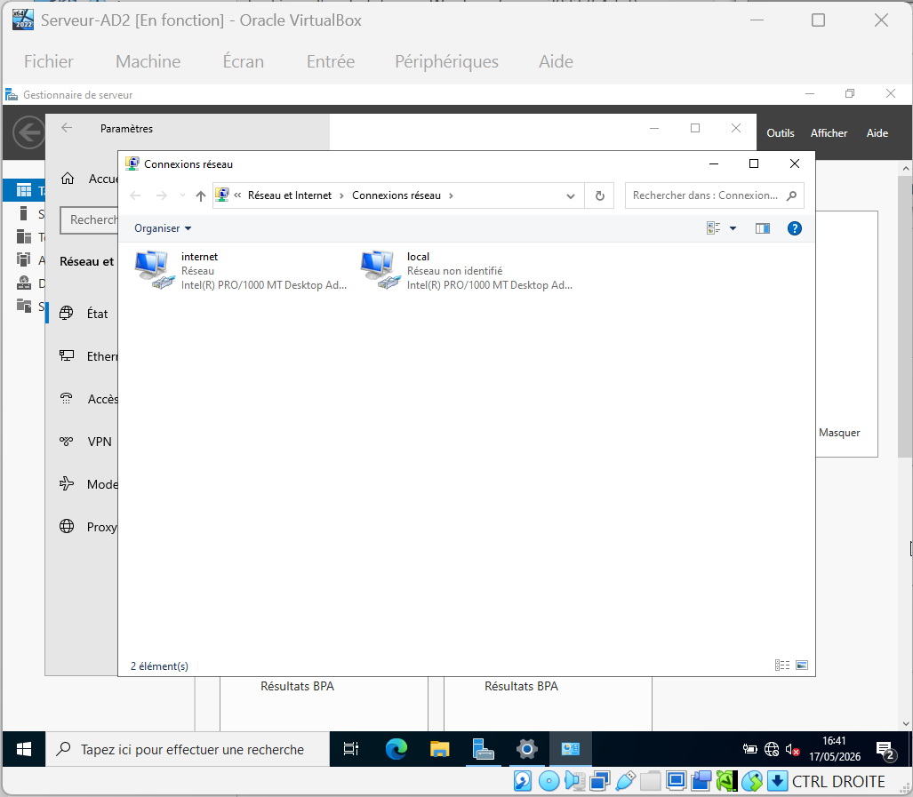

<h3 style="color:#16803c;">4.6. Configuration de la carte réseau interne</h3>

Faire un clic droit sur l'interface interne puis :

```
Propriétés
```

Sélectionner :

```
Protocole Internet version 4 (TCP/IPv4)
```

Puis cliquer sur :

```
Propriétés
```

Configurer :

```
Adresse IP : 192.168.1.10
Masque : 255.255.255.0
Passerelle : vide
DNS préféré : 192.168.1.10
```

Pourquoi utiliser son propre DNS ?

Le serveur Active Directory doit utiliser son propre service DNS.

Plus tard, le serveur hébergera la zone DNS du domaine :

```
entreprise.local
```

Les clients utiliseront également ce DNS afin de retrouver :

- le domaine ;
- les utilisateurs ;
- les services réseau.

Pourquoi laisser la passerelle vide ?

La carte interne ne doit pas accéder directement à Internet.

La passerelle sera uniquement définie sur :

```
la carte NAT
```

Cela évite :

- les conflits de routage ;
- les problèmes réseau ;
- les erreurs de résolution.

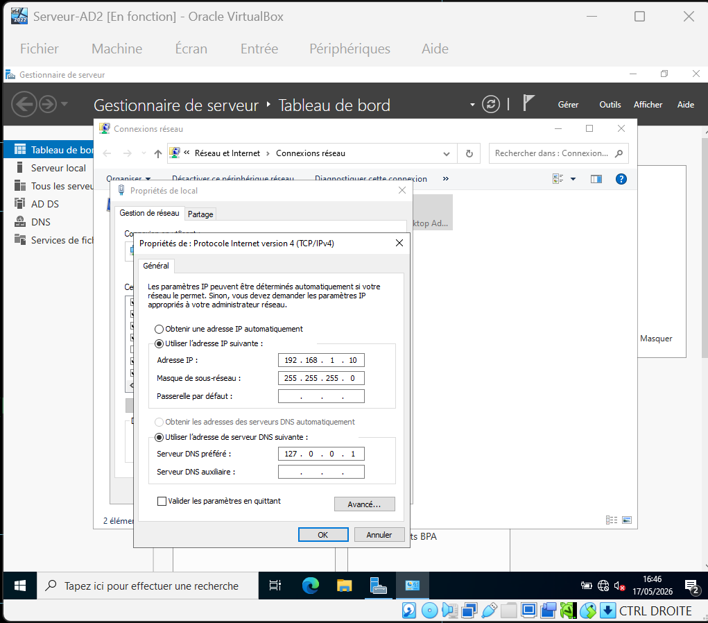

<h3 style="color:#16803c;">4.7. Configuration de la carte réseau Internet (NAT)</h3>

Ouvrir les propriétés IPv4 de la carte NAT.

Laisser :

```
Obtention automatique de l'adresse IP
```

Le NAT VirtualBox attribuera automatiquement une adresse du type :

```
10.0.2.x
```

Cette interface permettra au serveur d'accéder à Internet.

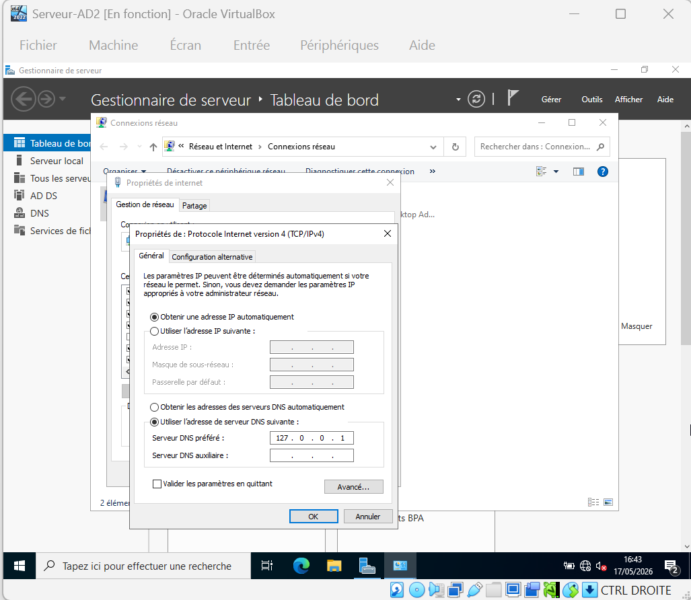

<h3 style="color:#16803c;">4.8. Vérification de la configuration</h3>

Ouvrir :

```
Invite de commandes
```

Puis exécuter :

```
ipconfig
```

Le résultat doit afficher :

```
Interface Internet
10.0.2.x

Interface Interne
192.168.1.10
```

<h3 style="color:#16803c;">4.9. Vérification d'Internet</h3>

Tester l'accès Internet depuis le serveur.

Exemple :

- ouvrir Microsoft Edge ;
- accéder à un site web ;
- effectuer les mises à jour Windows.

Le serveur doit posséder un accès Internet fonctionnel.

<h3 style="color:#16803c;">4.10. Résultat attendu</h3>

À la fin de cette étape :

- le serveur possède une IP fixe ;
- le DNS pointe vers lui-même ;
- les cartes réseau sont clairement identifiées ;
- l'accès Internet fonctionne ;
- le serveur est prêt pour l'installation d'Active Directory.

---

<h2 id="-étape-5--installation-du-rôle-active-directory-domain-services-ad-ds" style="color:#1e64d6;">⚙️ Étape 5 — Installation du rôle Active Directory Domain Services (AD DS)</h2>

<h3 style="color:#16803c;">5.1. Objectif de cette étape</h3>

L'objectif de cette étape est d'installer le rôle :

```
Active Directory Domain Services (AD DS)
```

Ce rôle permettra au serveur de devenir un :

- contrôleur de domaine ;
- serveur d'authentification ;
- serveur centralisé de gestion des utilisateurs et ordinateurs.

C'est l'élément principal de l'infrastructure Windows d'entreprise.

<h3 style="color:#16803c;">5.2. Qu'est-ce qu'Active Directory ?</h3>

Active Directory est un service d'annuaire développé par Microsoft.

Il permet de centraliser :

- les utilisateurs ;
- les groupes ;
- les ordinateurs ;
- les droits ;
- les stratégies de sécurité ;
- les ressources réseau.

Grâce à Active Directory, un administrateur peut gérer toute une infrastructure depuis un seul serveur.

<h3 style="color:#16803c;">5.3. Ouverture du Gestionnaire de serveur</h3>

Après connexion au serveur :

Ouvrir :

```
Gestionnaire de serveur
```

Cet outil s'ouvre normalement automatiquement au démarrage de Windows Server.

<h3 style="color:#16803c;">5.4. Lancement de l'assistant d'installation des rôles</h3>

Dans le Gestionnaire de serveur :

Cliquer sur :

```
Gérer
```

Puis :

```
Ajouter des rôles et fonctionnalités
```

L'assistant d'installation des rôles Windows Server s'ouvre alors.

<h3 style="color:#16803c;">5.5. Type d'installation</h3>

Sélectionner :

```
Installation basée sur un rôle ou une fonctionnalité
```

Puis cliquer sur :

```
Suivant
```

**Pourquoi choisir ce type d'installation ?**

Cette option permet d'installer des rôles directement sur le serveur actuel.

C'est la méthode standard utilisée dans les infrastructures Windows Server.

<h3 style="color:#16803c;">5.6. Sélection du serveur cible</h3>

Le serveur local doit apparaître automatiquement dans la liste.

Sélectionner le serveur puis cliquer sur :

```
Suivant
```

<h3 style="color:#16803c;">5.7. Sélection du rôle AD DS</h3>

Dans la liste des rôles, cocher :

```
Services de domaine Active Directory
```

Windows proposera automatiquement d'ajouter plusieurs fonctionnalités nécessaires.

Cliquer sur :

```
Ajouter des fonctionnalités
```

Puis cliquer sur :

```
Suivant
```

<h3 style="color:#16803c;">5.8. Fonctionnalités supplémentaires</h3>

Laisser les fonctionnalités proposées par défaut.

Cliquer simplement sur :

```
Suivant
```

<h3 style="color:#16803c;">5.9. Présentation du rôle AD DS</h3>

Windows affiche une description du rôle Active Directory.

Cette page explique les fonctionnalités principales :

- gestion centralisée ;
- authentification ;
- stratégie de groupe ;
- domaine Windows.

Cliquer sur :

```
Suivant
```

<h3 style="color:#16803c;">5.10. Confirmation de l'installation</h3>

L'écran final récapitule les éléments qui seront installés.

Cocher :

```
Redémarrer automatiquement le serveur si nécessaire
```

Puis cliquer sur :

```
Installer
```

**Pourquoi le redémarrage automatique est-il utile ?**

Certains rôles Windows nécessitent :

- des services système ;
- des modifications réseau ;
- des composants critiques.

Le redémarrage automatique évite les problèmes de configuration incomplète.

<h3 style="color:#16803c;">5.11. Fin de l'installation</h3>

Une fois l'installation terminée :

- le rôle AD DS est installé ;
- le serveur n'est pas encore un domaine ;
- aucune authentification centralisée n'existe encore.

Le serveur doit maintenant être :

- promu en contrôleur de domaine

**Important**

À cette étape :

Le rôle est installé, mais le domaine n'existe pas encore.

C'est la prochaine étape qui créera réellement :

- le domaine ;
- la forêt ;
- le contrôleur de domaine ;
- le DNS Active Directory.

<h3 style="color:#16803c;">5.12. Résultat attendu</h3>

À la fin de cette étape :

- le rôle AD DS doit être installé ;
- le Gestionnaire de serveur doit afficher les outils AD ;
- une notification de promotion doit apparaître en haut à droite du Gestionnaire de serveur.

---

<h2 id="-étape-6--promotion-du-serveur-en-contrôleur-de-domaine" style="color:#1e64d6;">🛡️ Étape 6 — Promotion du serveur en contrôleur de domaine</h2>

<h3 style="color:#16803c;">6.1. Objectif de cette étape</h3>

À l'étape précédente, le rôle Active Directory Domain Services (AD DS) a été installé.

Cependant, à ce stade, le serveur n'est pas encore un contrôleur de domaine.
Le rôle AD DS est simplement présent sur la machine, mais aucun domaine n'existe encore.

L'objectif de cette étape est donc de :

- créer une nouvelle forêt Active Directory ;
- créer le domaine entreprise.local ;
- transformer le serveur en contrôleur de domaine ;
- installer et configurer le DNS lié au domaine ;
- permettre ensuite l'intégration des postes clients dans le domaine.

<h3 style="color:#16803c;">6.2. Accès à la promotion du serveur</h3>

Après l'installation du rôle AD DS, le Gestionnaire de serveur affiche une notification en haut à droite, représentée par un petit drapeau avec un triangle jaune.

Cliquer sur cette notification.

Un lien apparaît :

```
Promouvoir ce serveur en contrôleur de domaine
```

Cliquer sur ce lien.

Cela ouvre l'assistant de configuration des services de domaine Active Directory.

<h3 style="color:#16803c;">6.3. Choix du type de déploiement</h3>

Dans la page Configuration de déploiement, plusieurs choix sont proposés.

Sélectionner :

```
Ajouter une nouvelle forêt
```

Pourquoi choisir "Ajouter une nouvelle forêt" ?

Dans ce laboratoire, aucun domaine Active Directory n'existe encore.

Il ne faut donc pas choisir :

```
Ajouter un contrôleur de domaine à un domaine existant
```

car cette option sert à ajouter un second contrôleur de domaine dans une infrastructure déjà existante.

Il ne faut pas non plus choisir :

```
Ajouter un nouveau domaine à une forêt existante
```

car aucune forêt Active Directory n'existe encore.

Le bon choix est donc :

```
Ajouter une nouvelle forêt
```

Cette option permet de créer la toute première structure Active Directory du laboratoire.

<h3 style="color:#16803c;">6.4. Nom du domaine racine</h3>

Dans le champ Nom de domaine racine, saisir :

```
entreprise.local
```

Puis cliquer sur :

```
Suivant
```

Pourquoi utiliser entreprise.local ?

Le domaine entreprise.local est utilisé pour créer un domaine interne de laboratoire.

Il ne correspond pas à un vrai domaine Internet public comme :

- google.com
- microsoft.com
- monentreprise.be

Il sert uniquement à l'intérieur du réseau local virtuel.

Dans ce TP, ce domaine permettra aux postes clients de rejoindre l'infrastructure Active Directory et de se connecter avec des comptes centralisés.

<h3 style="color:#16803c;">6.5. Options du contrôleur de domaine</h3>

Sur la page suivante, laisser les niveaux fonctionnels proposés par défaut :

```
Niveau fonctionnel de la forêt : Windows Server 2016
Niveau fonctionnel du domaine : Windows Server 2016
```

Pourquoi laisser Windows Server 2016 ?

Même si le serveur installé est Windows Server 2022, le niveau fonctionnel proposé est souvent Windows Server 2016.

Cela ne signifie pas que le serveur est ancien.

Le niveau fonctionnel définit surtout les fonctionnalités Active Directory disponibles dans le domaine.
Pour ce laboratoire, le niveau Windows Server 2016 est largement suffisant.

<h3 style="color:#16803c;">6.6. Options à laisser cochées</h3>

Vérifier que les options suivantes sont cochées :

- Serveur DNS
- Catalogue global (GC)

Laisser décochée l'option :

```
Contrôleur de domaine en lecture seule (RODC)
```

Explication des options

L'option Serveur DNS doit rester cochée car Active Directory dépend fortement du DNS.

Le DNS permettra aux clients de trouver :

- le domaine ;
- le contrôleur de domaine ;
- les services Active Directory ;
- les ressources internes.

L'option Catalogue global (GC) doit rester cochée car elle permet au contrôleur de domaine de contenir les informations nécessaires à la recherche d'objets dans l'annuaire.

L'option RODC ne doit pas être cochée.
Un RODC est un contrôleur de domaine en lecture seule, utilisé dans des situations particulières, par exemple dans une agence distante.
Dans ce laboratoire, le serveur principal doit être un contrôleur de domaine complet.

<h3 style="color:#16803c;">6.7. Mot de passe DSRM</h3>

L'assistant demande ensuite un mot de passe pour le mode de restauration des services d'annuaire.

Ce mot de passe est appelé :

```
Mot de passe DSRM
```

DSRM signifie :

```
Directory Services Restore Mode
```

Saisir un mot de passe, puis le confirmer.

À quoi sert le mot de passe DSRM ?

Ce mot de passe ne sert pas à se connecter normalement au domaine.

Il est utilisé uniquement dans des situations de maintenance avancée, par exemple :

- réparation d'Active Directory ;
- restauration de l'annuaire ;
- dépannage grave du contrôleur de domaine.

Il doit donc être conservé, même s'il ne sera probablement pas utilisé dans ce laboratoire.

<h3 style="color:#16803c;">6.8. Options DNS</h3>

L'assistant peut afficher un avertissement indiquant qu'il est impossible de créer une délégation DNS.

Ce message est normal dans ce laboratoire.

Il peut ressembler à ceci :

```
Impossible de créer une délégation pour ce serveur DNS
```

Ne rien modifier.

Ne pas cocher l'option de délégation DNS.

Cliquer simplement sur :

```
Suivant
```

Pourquoi ce message est normal ?

Le laboratoire crée un nouveau domaine interne depuis zéro.

Il n'existe donc pas de zone DNS parente capable de déléguer le domaine entreprise.local.

Dans un environnement d'entreprise plus complexe, une délégation DNS pourrait être nécessaire.
Dans ce TP, elle ne l'est pas.

<h3 style="color:#16803c;">6.9. Nom NetBIOS du domaine</h3>

L'assistant propose automatiquement un nom NetBIOS.

Pour le domaine :

```
entreprise.local
```

Windows propose généralement :

```
ENTREPRISE
```

Laisser cette valeur par défaut.

Cliquer sur :

```
Suivant
```

À quoi sert le nom NetBIOS ?

Le nom NetBIOS est une version courte du nom de domaine.

Il peut être utilisé lors de la connexion d'un utilisateur.

Exemple :

```
ENTREPRISE\younes
```

Dans cet exemple :

- ENTREPRISE représente le domaine ;
- younes représente l'utilisateur.

<h3 style="color:#16803c;">6.10. Chemins d'accès Active Directory</h3>

L'assistant propose ensuite les emplacements par défaut pour les fichiers Active Directory :

```
Base de données : C:\Windows\NTDS
Fichiers journaux : C:\Windows\NTDS
SYSVOL : C:\Windows\SYSVOL
```

Laisser les chemins par défaut.

Cliquer sur :

```
Suivant
```

Pourquoi garder les chemins par défaut ?

Dans un laboratoire, il n'est pas nécessaire de séparer les fichiers Active Directory sur plusieurs disques.

Les chemins par défaut sont suffisants pour :

- un serveur de test ;
- un domaine simple ;
- un environnement pédagogique.

Dans une infrastructure professionnelle plus avancée, il pourrait être pertinent de séparer certains fichiers sur différents volumes pour des raisons de performance ou de sécurité.

<h3 style="color:#16803c;">6.11. Vérification des options</h3>

L'assistant affiche ensuite un résumé de la configuration choisie.

Vérifier les éléments principaux :

- Nouvelle forêt
- Domaine : entreprise.local
- DNS installé
- Catalogue global activé
- Nom NetBIOS : ENTREPRISE

Cliquer sur :

```
Suivant
```

<h3 style="color:#16803c;">6.12. Vérification des prérequis</h3>

Windows effectue une vérification automatique avant l'installation.

Si tout est correct, un message indique que la vérification des prérequis est réussie.

Il est possible que des avertissements jaunes apparaissent.

Ces avertissements sont normaux dans un laboratoire, notamment ceux liés :

- à la délégation DNS ;
- à certains paramètres de sécurité anciens ;
- à la compatibilité.

Tant qu'il n'y a pas d'erreur bloquante, il est possible de continuer.

Cliquer sur :

```
Installer
```

<h3 style="color:#16803c;">6.13. Installation et redémarrage</h3>

Windows configure alors le serveur comme contrôleur de domaine.

Pendant cette étape, le serveur :

- crée la forêt Active Directory ;
- crée le domaine entreprise.local ;
- installe/configure le DNS ;
- crée les dossiers nécessaires ;
- configure SYSVOL ;
- prépare les services Active Directory.

À la fin de l'installation, le serveur redémarre automatiquement.

Il ne faut pas interrompre ce redémarrage.

<h3 style="color:#16803c;">6.14. Connexion après redémarrage</h3>

Après le redémarrage, l'écran de connexion change.

Le serveur n'est plus simplement un serveur local.
Il est maintenant membre du domaine qu'il vient de créer.

La connexion peut apparaître sous la forme :

```
ENTREPRISE\Administrateur
```

ou avec le compte administrateur du domaine.

<h3 style="color:#16803c;">6.15. Résultat attendu</h3>

À la fin de cette étape :

- le serveur est promu contrôleur de domaine ;
- le domaine entreprise.local existe ;
- le DNS du domaine est installé ;
- le serveur peut gérer les utilisateurs et ordinateurs du domaine ;
- le Gestionnaire de serveur affiche les rôles AD DS et DNS.

Cette étape marque la création réelle de l'infrastructure Active Directory du laboratoire.

---

<h2 id="-étape-7--vérification-du-contrôleur-de-domaine-et-des-outils-active-directory" style="color:#1e64d6;">✅ Étape 7 — Vérification du contrôleur de domaine et des outils Active Directory</h2>

<h3 style="color:#16803c;">7.1. Objectif de cette étape</h3>

Après la promotion du serveur en contrôleur de domaine, il est important de vérifier que :

- Active Directory fonctionne correctement ;
- le domaine a bien été créé ;
- les outils d'administration AD sont disponibles ;
- le serveur DNS fonctionne ;
- le contrôleur de domaine répond correctement.

Cette étape permet donc de confirmer que l'infrastructure de base est opérationnelle avant d'ajouter des utilisateurs et des postes clients.

<h3 style="color:#16803c;">7.2. Vérification du nom du domaine</h3>

Une fois connecté au serveur :

Ouvrir :

```
Gestionnaire de serveur
```

Dans le menu de gauche, cliquer sur :

```
Serveur local
```

Dans les informations du serveur, vérifier :

```
Domaine : entreprise.local
```

Pourquoi cette vérification est importante ?

Avant la promotion :

- le serveur faisait partie d'un groupe de travail local ;
- il ne possédait aucun domaine Active Directory.

Après la promotion :

- le serveur devient contrôleur de domaine ;
- le domaine entreprise.local doit apparaître dans les informations système.

Cette vérification confirme donc que la promotion AD DS a réussi.

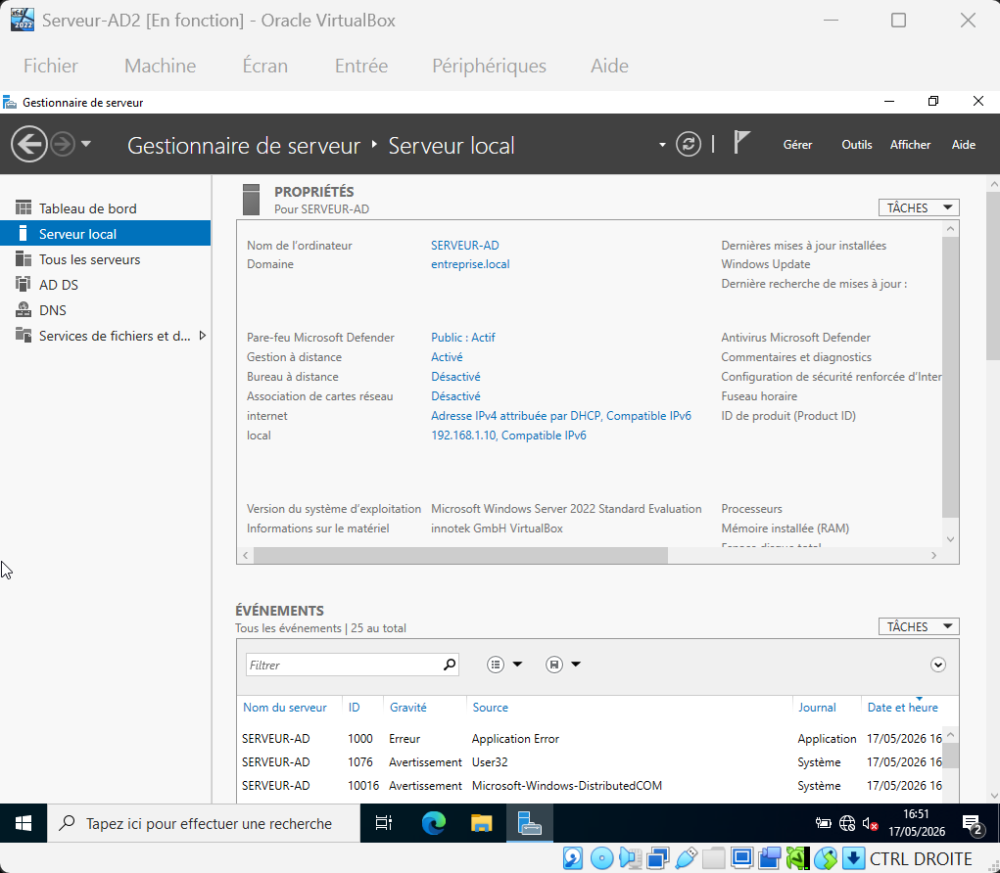

<h3 style="color:#16803c;">7.3. Vérification des rôles installés</h3>

Dans le Gestionnaire de serveur, vérifier que les éléments suivants apparaissent dans le menu de gauche :

- AD DS
- DNS

Explication

Le rôle :

```
AD DS
```

correspond aux services Active Directory.

Le rôle :

```
DNS
```

correspond au serveur DNS installé automatiquement pendant la promotion.

Ces deux rôles sont essentiels au fonctionnement du domaine.

Sans DNS, les clients ne pourraient pas localiser le contrôleur de domaine.

<h3 style="color:#16803c;">7.4. Ouverture des outils Active Directory</h3>

Dans le Gestionnaire de serveur :

Cliquer sur :

```
Outils
```

Vérifier la présence des outils suivants :

- Utilisateurs et ordinateurs Active Directory
- DNS
- Gestion de stratégie de groupe
- Sites et services Active Directory

Pourquoi ces outils sont importants ?

**Utilisateurs et ordinateurs Active Directory**

Permet de :

- créer des utilisateurs ;
- créer des groupes ;
- gérer les ordinateurs du domaine ;
- organiser l'infrastructure Active Directory.

**DNS**

Permet de gérer :

- les zones DNS ;
- la résolution des noms ;
- les enregistrements du domaine.

**Gestion de stratégie de groupe (GPO)**

Permet d'appliquer des règles automatiquement :

- sécurité ;
- configuration Windows ;
- restrictions ;
- scripts ;
- paramètres réseau.

**Sites et services Active Directory**

Permet de gérer les contrôleurs de domaine et la réplication dans des infrastructures plus complexes.

<h3 style="color:#16803c;">7.5. Vérification de la console "Utilisateurs et ordinateurs Active Directory"</h3>

Dans :

```
Outils
```

ouvrir :

```
Utilisateurs et ordinateurs Active Directory
```

Dans le panneau de gauche, vérifier la présence du domaine :

```
entreprise.local
```

Développer ensuite le domaine.

Plusieurs dossiers doivent apparaître, notamment :

- Builtin
- Computers
- Domain Controllers
- Users

Explication des dossiers principaux

**Builtin**

Contient des groupes système intégrés à Windows.

**Computers**

Contient les ordinateurs qui rejoindront le domaine.

**Domain Controllers**

Contient les contrôleurs de domaine.

Le serveur actuel doit apparaître dans ce dossier.

**Users**

Contient les comptes utilisateurs et groupes par défaut du domaine.

<h3 style="color:#16803c;">7.6. Vérification du serveur DNS</h3>

Dans :

```
Outils
```

ouvrir :

```
DNS
```

Développer :

```
Serveur
→ Zones de recherche directe
```

La zone suivante doit apparaître :

```
entreprise.local
```

Pourquoi cette vérification est essentielle ?

Active Directory dépend entièrement du DNS.

Le DNS permet notamment :

- de localiser le contrôleur de domaine ;
- d'authentifier les utilisateurs ;
- de rejoindre le domaine ;
- de trouver les services réseau.

Si la zone DNS du domaine n'existe pas, les postes clients ne pourront pas rejoindre le domaine correctement.

<h3 style="color:#16803c;">7.7. Vérification du contrôleur de domaine dans Active Directory</h3>

Retourner dans :

```
Utilisateurs et ordinateurs Active Directory
```

Ouvrir :

```
Domain Controllers
```

Le serveur doit apparaître dans ce dossier.

Exemple :

```
SERVEUR-AD
```

Pourquoi cette vérification est importante ?

Cela confirme que :

- le serveur est bien reconnu comme contrôleur de domaine ;
- Active Directory fonctionne correctement ;
- la promotion AD DS est terminée avec succès.

<h3 style="color:#16803c;">7.8. Vérification de la résolution DNS</h3>

Ouvrir :

```
Invite de commandes
```

Puis taper :

```
nslookup
```

Le serveur DNS utilisé doit apparaître.

Exemple :

```
Serveur : serveur-ad.entreprise.local
```

Pour quitter :

```
exit
```

Pourquoi utiliser nslookup ?

La commande :

```
nslookup
```

permet de tester le fonctionnement du DNS.

Comme Active Directory repose sur le DNS, cette vérification permet de confirmer que :

- le serveur DNS répond ;
- le domaine est détecté ;
- la résolution de noms fonctionne.

<h3 style="color:#16803c;">7.9. Résultat attendu</h3>

À la fin de cette étape :

- le domaine entreprise.local doit être visible ;
- les outils Active Directory doivent être disponibles ;
- le serveur doit apparaître comme contrôleur de domaine ;
- la zone DNS doit être créée ;
- le DNS doit répondre correctement ;
- Active Directory doit être opérationnel.

Le serveur est maintenant prêt à :

- créer des utilisateurs ;
- créer des groupes ;
- intégrer des postes clients dans le domaine ;
- appliquer des stratégies de groupe (GPO).

---

<h2 id="-étape-8--renommage-du-serveur-et-configuration-ip-statique" style="color:#1e64d6;">🧩 Étape 8 — Renommage du serveur et configuration IP statique</h2>

<h3 style="color:#16803c;">8.1. Objectif de cette étape</h3>

À cette étape, le serveur va être configuré de manière plus professionnelle afin de préparer correctement l'infrastructure réseau.

Deux éléments essentiels vont être mis en place :

- un nom de serveur clair et identifiable ;
- une adresse IP statique.

Ces deux configurations sont indispensables dans une infrastructure Active Directory.

<h3 style="color:#16803c;">8.2. Pourquoi renommer le serveur ?</h3>

Actuellement, Windows utilise un nom généré automatiquement, par exemple :

```
WIN-UJPLL28M6IL
```

Ce type de nom est difficile à identifier dans un réseau professionnel.

Dans une infrastructure réelle, les serveurs possèdent toujours des noms explicites afin de :

- faciliter l'administration ;
- reconnaître rapidement les machines ;
- simplifier le dépannage ;
- améliorer la lisibilité du réseau.

Le serveur sera donc renommé :

```
SERVEUR-AD
```

<h3 style="color:#16803c;">8.3. Pourquoi utiliser une adresse IP statique ?</h3>

Par défaut, Windows utilise souvent :

```
DHCP
```

Le DHCP attribue automatiquement une adresse IP.

Cependant, un contrôleur de domaine doit toujours avoir :

```
une adresse IP fixe
```

Pourquoi ?

Parce que :

- les clients doivent toujours retrouver le serveur à la même adresse ;
- le DNS Active Directory dépend fortement de l'IP du serveur ;
- une IP qui change casserait l'authentification du domaine.

<h3 style="color:#16803c;">8.4. Renommage du serveur</h3>

**Ouverture des paramètres système**

Dans le Gestionnaire de serveur :

Cliquer sur :

```
Serveur local
```

Dans la section :

```
Nom de l'ordinateur
```

cliquer sur :

```
Modifier
```

**Modification du nom**

Dans :

```
Nom de l'ordinateur
```

remplacer le nom actuel par :

```
SERVEUR-AD
```

Puis cliquer sur :

```
OK
```

Windows demandera alors un redémarrage.

Cliquer sur :

```
Redémarrer maintenant
```

<h3 style="color:#16803c;">8.5. Vérification après redémarrage</h3>

Après reconnexion :

ouvrir :

```
Gestionnaire de serveur
→ Serveur local
```

Vérifier que le nom affiché est maintenant :

```
SERVEUR-AD
```

<h3 style="color:#16803c;">8.6. Comprendre les deux cartes réseau du serveur</h3>

Le serveur possède actuellement deux cartes réseau :

**Carte "internet"**

Cette carte correspond au mode :

```
NAT
```

Elle sert uniquement à :

- donner accès à Internet ;
- permettre les téléchargements et mises à jour Windows.

Cette carte doit rester :

```
en configuration automatique (DHCP)
```

Il ne faut pas modifier cette interface.

**Carte "local"**

Cette carte correspond au réseau :

```
Host-Only VirtualBox
```

Elle sert à la communication interne entre :

- le serveur ;
- les PC clients ;
- Active Directory ;
- le DNS.

C'est cette carte qui doit recevoir :

```
une adresse IP statique
```

<h3 style="color:#16803c;">8.7. Configuration de l'adresse IP statique</h3>

**Ouverture des paramètres réseau**

Dans :

```
Serveur local
```

cliquer sur :

```
Ethernet
```

La fenêtre des connexions réseau Windows s'ouvre.

<h3 style="color:#16803c;">8.8. Ouverture des propriétés IPv4</h3>

Faire :

clic droit sur :

```
local
```

Puis :

```
Propriétés
```

Sélectionner :

```
Protocole Internet version 4 (TCP/IPv4)
```

Puis cliquer sur :

```
Propriétés
```

<h3 style="color:#16803c;">8.9. Configuration IPv4</h3>

Sélectionner :

```
Utiliser l'adresse IP suivante
```

Puis configurer :

```
Adresse IP : 192.168.1.10
Masque de sous-réseau : 255.255.255.0
Passerelle par défaut : laisser vide
```

Pourquoi laisser la passerelle vide ?

Dans ce TP :

- le réseau "local" sert uniquement à la communication interne du domaine ;
- l'accès Internet est déjà fourni par la carte NAT.

La passerelle peut donc être laissée vide afin d'éviter des conflits réseau.

<h3 style="color:#16803c;">8.10. Configuration du DNS</h3>

Dans :

```
Serveur DNS préféré
```

mettre :

```
192.168.1.10
```

c'est-à-dire :

```
l'adresse IP du serveur lui-même
```

Pourquoi le serveur pointe vers lui-même ?

Le serveur Active Directory possède également le rôle :

```
DNS
```

Il doit donc utiliser son propre service DNS pour :

- résoudre le domaine ;
- authentifier les utilisateurs ;
- localiser les services Active Directory.

<h3 style="color:#16803c;">8.11. Validation de la configuration</h3>

Cliquer sur :

```
OK
```

Puis :

```
Fermer
```

<h3 style="color:#16803c;">8.12. Vérification de la configuration réseau</h3>

Ouvrir :

```
Invite de commandes
```

Puis taper :

```
ipconfig
```

Vérifier :

- l'adresse IP ;
- le masque ;
- le DNS.

Exemple attendu :

```
IPv4 : 192.168.1.10
DNS : 192.168.1.10
```

<h3 style="color:#16803c;">8.13. Pourquoi cette étape est essentielle ?</h3>

Cette étape prépare réellement l'infrastructure réseau.

Le serveur dispose maintenant :

- d'un nom propre ;
- d'une IP fixe ;
- d'un DNS correctement configuré.

Sans cette étape :

- les clients pourraient perdre la connexion au domaine ;
- le DNS pourrait devenir instable ;
- Active Directory fonctionnerait mal.

<h3 style="color:#16803c;">8.14. Résultat attendu</h3>

À la fin de cette étape :

- le serveur doit s'appeler :

```
SERVEUR-AD
```

- le serveur doit posséder une IP statique ;
- le DNS doit pointer vers lui-même ;
- ipconfig doit afficher les bonnes informations ;
- le serveur doit être prêt à accueillir les postes clients du domaine.

---

<h2 id="-étape-9--création-des-utilisateurs-active-directory" style="color:#1e64d6;">👤 Étape 9 — Création des utilisateurs Active Directory</h2>

<h3 style="color:#16803c;">9.1. Objectif de cette étape</h3>

Maintenant que :

- le domaine Active Directory fonctionne ;
- le DNS est opérationnel ;
- le serveur possède une IP statique ;

il est possible de commencer à créer des utilisateurs du domaine.

Cette étape permettra :

- de comprendre la gestion centralisée des comptes ;
- de préparer les futurs postes clients ;
- de tester l'authentification Active Directory.

<h3 style="color:#16803c;">9.2. Pourquoi créer des utilisateurs dans Active Directory ?</h3>

Dans une infrastructure Windows classique sans domaine :

- chaque PC possède ses propres utilisateurs locaux ;
- les comptes sont séparés ;
- les mots de passe doivent être gérés machine par machine.

Avec Active Directory :

- les utilisateurs sont centralisés ;
- un seul compte permet de se connecter sur plusieurs PC ;
- l'administrateur gère tout depuis le serveur.

C'est l'un des principaux avantages d'un environnement de domaine.

<h3 style="color:#16803c;">9.3. Ouverture de la console Active Directory</h3>

Dans le Gestionnaire de serveur :

Cliquer sur :

```
Outils
```

Puis ouvrir :

```
Utilisateurs et ordinateurs Active Directory
```

La console d'administration Active Directory s'ouvre.

<h3 style="color:#16803c;">9.4. Structure d'Active Directory</h3>

Dans le panneau de gauche :

développer :

```
entreprise.local
```

Plusieurs dossiers apparaissent :

- Builtin
- Computers
- Domain Controllers
- Users

À quoi servent ces dossiers ?

**Users**

Contient :

- les utilisateurs du domaine ;
- les groupes par défaut ;
- les comptes administrateurs.

C'est dans ce dossier que les premiers utilisateurs vont être créés.

**Computers**

Contiendra les postes clients qui rejoindront le domaine.

**Domain Controllers**

Contient les serveurs contrôleurs de domaine.

<h3 style="color:#16803c;">9.5. Création d'un nouvel utilisateur</h3>

Dans le panneau de gauche :

faire :

clic droit sur :

```
Users
```

Puis :

```
Nouveau
→ Utilisateur
```

<h3 style="color:#16803c;">9.6. Informations de l'utilisateur</h3>

Remplir les informations demandées.

Exemple :

```
Prénom : Younes
Nom : Andaloussi
Nom d'ouverture de session : y.andaloussi
```

Puis cliquer sur :

```
Suivant
```

<h3 style="color:#16803c;">9.7. Configuration du mot de passe</h3>

Définir un mot de passe.

Exemple :

```
Azerty123!
```

Puis configurer les options.

Pour un TP pédagogique, cocher :

```
Le mot de passe n'expire jamais
```

et décocher :

```
L'utilisateur doit changer le mot de passe à la prochaine ouverture de session
```

Puis cliquer sur :

```
Suivant
```

<h3 style="color:#16803c;">9.8. Finalisation</h3>

Cliquer sur :

```
Terminer
```

Le nouvel utilisateur apparaît maintenant dans :

```
Users
```

<h3 style="color:#16803c;">9.9. Vérification de l'utilisateur</h3>

Dans la liste des utilisateurs :

vérifier la présence du compte créé.

Exemple :

```
y.andaloussi
```

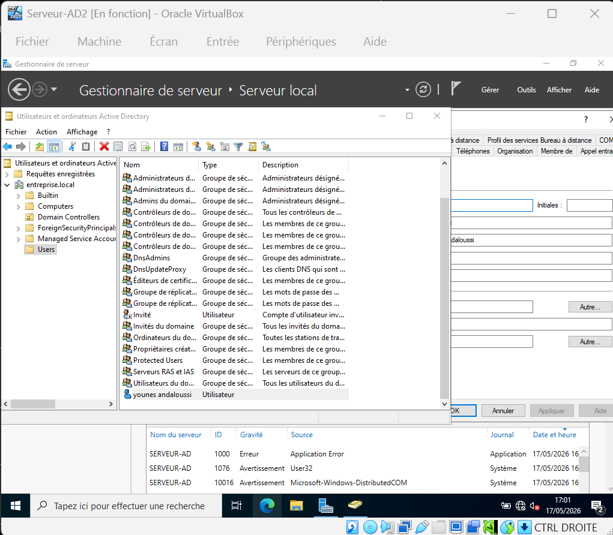

<h3 style="color:#16803c;">9.10. Pourquoi cette étape est importante ?</h3>

Cette étape montre le principe fondamental d'Active Directory :

```
la centralisation des comptes utilisateurs
```

Le compte créé pourra plus tard :

- se connecter sur les postes clients ;
- accéder aux ressources réseau ;
- recevoir des stratégies de groupe (GPO) ;
- être administré depuis le serveur.

<h3 style="color:#16803c;">9.11. Comprendre les types de comptes</h3>

Dans Active Directory, il existe plusieurs types de comptes :

**Comptes utilisateurs**

Utilisés par les personnes réelles.

Exemple :

```
y.andaloussi
```

**Comptes ordinateurs**

Créés automatiquement lorsqu'un PC rejoint le domaine.

**Comptes administrateurs**

Possèdent des privilèges élevés sur le domaine.

<h3 style="color:#16803c;">9.12. Résultat attendu</h3>

À la fin de cette étape :

- la console Active Directory doit être accessible ;
- un utilisateur du domaine doit être créé ;
- le compte doit apparaître dans :

```
Users
```

- le domaine est maintenant prêt à accueillir des postes clients utilisant ce compte Active Directory.

---

<h2 id="-étape-10--création-des-machines-virtuelles-clientes-pc-1-et-pc-2" style="color:#1e64d6;">💻 Étape 10 — Création des machines virtuelles clientes (PC-1 et PC-2)</h2>

<h3 style="color:#16803c;">10.1. Objectif de cette étape</h3>

L'objectif de cette étape est de créer les postes clients qui seront intégrés au domaine Active Directory.

Deux machines virtuelles seront créées :

- PC-1
- PC-2

Ces postes permettront de :

- tester la connexion au domaine ;
- tester l'authentification Active Directory ;
- vérifier le fonctionnement du DNS ;
- simuler une infrastructure d'entreprise réelle.

<h3 style="color:#16803c;">10.2. Pourquoi utiliser des postes clients ?</h3>

Dans une infrastructure Active Directory réelle :

- les utilisateurs ne travaillent pas directement sur le serveur ;
- ils utilisent des postes clients reliés au domaine.

Les postes clients permettent :

- l'ouverture de session avec les comptes Active Directory ;
- l'application des stratégies de groupe ;
- l'accès centralisé aux ressources réseau ;
- la gestion centralisée des utilisateurs et ordinateurs.

<h3 style="color:#16803c;">10.3. Création de la machine virtuelle PC-1</h3>

Dans VirtualBox :

Cliquer sur :

```
Nouvelle
```

<h3 style="color:#16803c;">10.4. Configuration générale de la machine virtuelle</h3>

Configurer :

```
Nom : PC-1
OS : Microsoft Windows
Version : Windows 10 (64-bit)
```

Pourquoi utiliser Windows 10 ?

Dans ce laboratoire :

- Windows 10 est plus stable sous VirtualBox ;
- il provoque moins de problèmes de démarrage ;
- il consomme moins de ressources ;
- il reste très utilisé en entreprise.

Même si Windows 11 fonctionne également, Windows 10 est plus confortable dans un environnement VirtualBox pédagogique.

<h3 style="color:#16803c;">10.5. Sélection de l'image ISO</h3>

Sélectionner l'image ISO de Windows 10 Professionnel.

Exemple :

```
Windows 10 Pro
```

Important

Il est impératif d'utiliser :

```
Windows 10 Professionnel
```

et non :

```
Windows 10 Home
```

car les éditions Home ne peuvent pas rejoindre un domaine Active Directory.

<h3 style="color:#16803c;">10.6. Désactivation de l'installation automatique</h3>

Décocher :

```
Proceed with unattended installation
```

Pourquoi désactiver cette option ?

L'installation automatique VirtualBox peut :

- provoquer des erreurs ;
- compliquer le dépannage ;
- modifier automatiquement certains paramètres ;
- rendre l'apprentissage moins pédagogique.

Une installation manuelle permet :

- de garder un contrôle total ;
- de mieux comprendre chaque étape ;
- d'éviter certains problèmes liés à VirtualBox.

<h3 style="color:#16803c;">10.7. Configuration matérielle</h3>

Exemple de configuration utilisée :

```
RAM : 4096 MB
CPU : 2 processeurs
```

Important

Les valeurs utilisées dans ce laboratoire dépendent :

- de la puissance du PC hôte ;
- de la quantité de RAM disponible ;
- du processeur du PC physique.

Ces paramètres peuvent donc être adaptés selon la configuration utilisée.

<h3 style="color:#16803c;">10.8. Configuration du disque virtuel</h3>

Créer un nouveau disque virtuel :

```
VDI (VirtualBox Disk Image)
```

Taille recommandée :

```
50 Go
```

<h3 style="color:#16803c;">10.9. Paramètres système VirtualBox</h3>

Après la création de la machine virtuelle :

ouvrir :

```
Configuration
→ Système
```

Vérifier :

```
I/O APIC : activé
UEFI : désactivé
```

Pourquoi désactiver UEFI ?

Durant les tests du laboratoire :

- plusieurs problèmes de démarrage ont été rencontrés avec UEFI ;
- certains redémarrages restaient bloqués sur écran noir ;
- le BIOS classique s'est montré plus stable dans VirtualBox.

Pour garantir un environnement stable :

```
UEFI a été volontairement désactivé
```

<h3 style="color:#16803c;">10.10. Configuration réseau des postes clients</h3>

Ouvrir :

```
Configuration
→ Réseau
```

Configurer uniquement une seule carte réseau.

**Adaptateur 1**

Configurer :

```
Activer la carte réseau : Oui
Mode d'accès réseau : Réseau privé hôte (Host-Only)
Nom : VirtualBox Host-Only Ethernet Adapter
```

**Adaptateur 2**

Laisser :

```
désactivé
```

Pourquoi les clients n'utilisent pas directement Internet ?

Dans cette infrastructure, les postes clients ne doivent pas accéder directement à Internet.

L'objectif est de reproduire une architecture plus proche d'une entreprise réelle :

```
PC clients → Serveur → Internet
```

Le serveur jouera plus tard le rôle de :

- routeur ;
- passerelle ;
- point central du trafic réseau.

Cette architecture permet :

- de centraliser les accès réseau ;
- de mieux contrôler le trafic ;
- d'améliorer la sécurité ;
- d'éviter que chaque poste sorte directement sur Internet.

**Rôle du serveur dans l'accès Internet**

Le serveur possède actuellement deux cartes réseau :

- Carte Internet : NAT
- Carte Locale : Host-Only

Les clients possèdent uniquement :

```
une carte Host-Only
```

Plus tard, les postes clients utiliseront :

```
192.168.1.10
```

comme :

- passerelle ;
- serveur DNS.

Le trafic Internet des clients passera donc obligatoirement par le serveur.

<h3 style="color:#16803c;">10.11. Installation de Windows 10</h3>

Démarrer la machine virtuelle.

Installer Windows normalement :

- choix de la langue ;
- clavier ;
- partition ;
- création d'un utilisateur local temporaire.

<h3 style="color:#16803c;">10.12. Nom du poste client</h3>

Pendant l'installation Windows, utiliser un nom simple et identifiable.

Exemple :

```
PC-1
```

<h3 style="color:#16803c;">10.13. Création de PC-2</h3>

Refaire exactement les mêmes étapes pour la deuxième machine virtuelle :

```
PC-2
```

<h3 style="color:#16803c;">10.14. Résultat attendu</h3>

À la fin de cette étape :

- deux postes clients doivent être créés ;
- Windows 10 doit être installé ;
- les machines doivent démarrer correctement ;
- les cartes réseau doivent être configurées en Host-Only ;
- les clients doivent pouvoir communiquer avec le serveur Active Directory.

Les postes clients seront ensuite :

- configurés en IP statique ;
- reliés au DNS du serveur ;
- intégrés au domaine entreprise.local.

---

<h2 id="-étape-11--configuration-réseau-des-postes-clients" style="color:#1e64d6;">🔌 Étape 11 — Configuration réseau des postes clients</h2>

<h3 style="color:#16803c;">11.1. Objectif de cette étape</h3>

Maintenant que :

- les postes clients existent ;
- Windows 10 est installé ;
- le serveur Active Directory fonctionne ;

il est nécessaire de configurer correctement le réseau des clients afin qu'ils puissent :

- communiquer avec le serveur ;
- utiliser le DNS Active Directory ;
- rejoindre le domaine ;
- accéder plus tard à Internet via le serveur.

Cette étape est essentielle car Active Directory dépend fortement du DNS et de la communication réseau.

<h3 style="color:#16803c;">11.2. Pourquoi utiliser une configuration réseau manuelle ?</h3>

Dans ce laboratoire, les postes clients sont configurés manuellement afin de :

- mieux comprendre le fonctionnement réseau ;
- maîtriser les paramètres utilisés ;
- éviter les problèmes liés au DHCP ;
- faciliter le dépannage.

Dans une infrastructure plus avancée, un serveur DHCP pourrait être utilisé pour distribuer automatiquement les adresses IP.

<h3 style="color:#16803c;">11.3. Ouverture des paramètres réseau</h3>

Sur le poste client :

ouvrir :

```
Paramètres
→ Réseau et Internet
→ Modifier les options d'adaptateur
```

La carte réseau Host-Only doit apparaître.

<h3 style="color:#16803c;">11.4. Ouverture des propriétés IPv4</h3>

Faire :

clic droit sur :

```
Ethernet
```

Puis :

```
Propriétés
```

Sélectionner :

```
Protocole Internet version 4 (TCP/IPv4)
```

Puis cliquer sur :

```
Propriétés
```

<h3 style="color:#16803c;">11.5. Configuration IP de PC-1</h3>

Sélectionner :

```
Utiliser l'adresse IP suivante
```

Puis configurer :

```
Adresse IP : 192.168.1.20
Masque de sous-réseau : 255.255.255.0
Passerelle par défaut : 192.168.1.10
Serveur DNS préféré : 192.168.1.10
```

Explication des paramètres

**Adresse IP**

Chaque machine du réseau doit posséder une adresse unique.

Le serveur utilise :

```
192.168.1.10
```

Le client utilise donc :

```
192.168.1.20
```

**Masque de sous-réseau**

Le masque :

```
255.255.255.0
```

indique que les machines appartiennent au même réseau local.

**Passerelle**

La passerelle :

```
192.168.1.10
```

correspond au serveur Active Directory.

Plus tard, le serveur jouera le rôle de routeur et permettra aux clients d'accéder à Internet.

Le trafic réseau des clients passera donc par le serveur.

**DNS**

Le DNS doit impérativement pointer vers :

```
192.168.1.10
```

c'est-à-dire :

```
le serveur Active Directory
```

Pourquoi ne pas utiliser Google DNS ou Cloudflare ?

Il ne faut surtout PAS utiliser :

```
8.8.8.8
1.1.1.1
```

sur les postes du domaine.

Pourquoi ?

Parce que les clients doivent pouvoir trouver :

- le domaine ;
- le contrôleur Active Directory ;
- les services réseau internes.

Seul le DNS du serveur Active Directory connaît ces informations.

<h3 style="color:#16803c;">11.6. Configuration IP de PC-2</h3>

Répéter exactement les mêmes étapes sur :

```
PC-2
```

avec l'adresse :

```
192.168.1.30
```

Configuration complète :

```
Adresse IP : 192.168.1.30
Masque : 255.255.255.0
Passerelle : 192.168.1.10
DNS : 192.168.1.10
```

<h3 style="color:#16803c;">11.7. Vérification de la configuration réseau</h3>

Ouvrir :

```
Invite de commandes
```

Puis taper :

```
ipconfig
```

Vérifier :

- l'adresse IP ;
- le masque ;
- la passerelle ;
- le DNS.

<h3 style="color:#16803c;">11.8. Test de communication avec le serveur</h3>

Depuis le poste client :

ouvrir :

```
Invite de commandes
```

Puis tester :

```
ping 192.168.1.10
```

Résultat attendu

Le serveur doit répondre.

Exemple :

```
Réponse de 192.168.1.10
```

Pourquoi ce test est important ?

Ce test permet de vérifier :

- la connectivité réseau ;
- le bon fonctionnement du réseau Host-Only ;
- la communication entre le client et le serveur.

Sans cette communication :

- le poste ne pourra pas rejoindre le domaine ;
- Active Directory ne fonctionnera pas correctement.

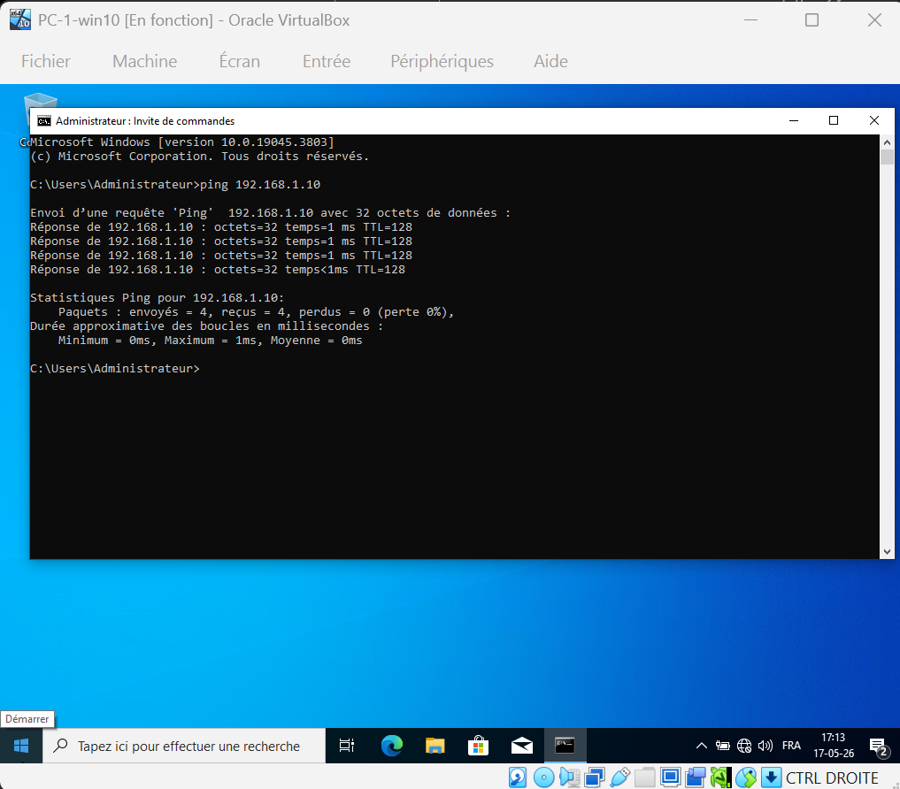

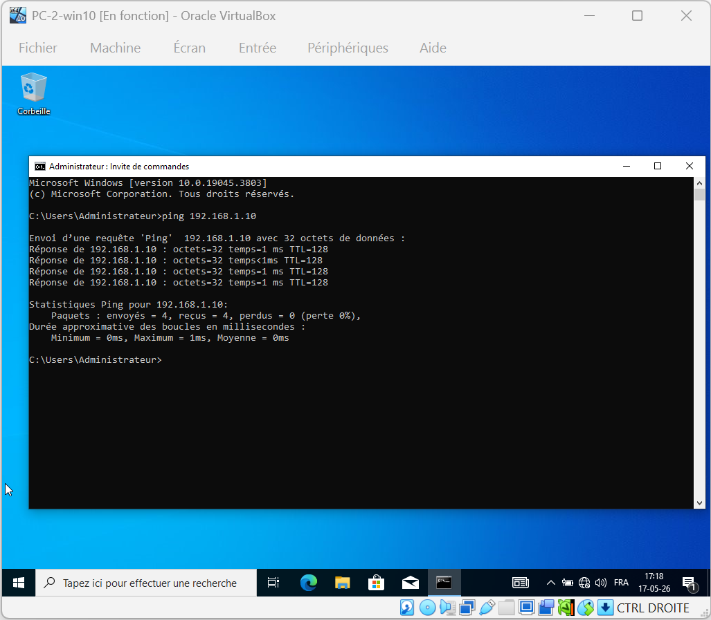

<h3 style="color:#16803c;">11.9. Vérification DNS</h3>

Depuis le client :

taper :

```
nslookup
```

Le serveur DNS doit apparaître.

Exemple :

```
Serveur : SERVEUR-AD.entreprise.local
Address : 192.168.1.10
```

Pour quitter :

```
exit
```

Pourquoi tester le DNS ?

Active Directory repose entièrement sur le DNS.

Si le DNS ne fonctionne pas :

- le domaine sera introuvable ;
- l'authentification échouera ;
- les GPO ne fonctionneront pas ;
- le poste ne pourra pas rejoindre le domaine.

<h3 style="color:#16803c;">11.10. Résultat attendu</h3>

À la fin de cette étape :

- les clients doivent posséder une IP statique ;
- le DNS doit pointer vers le serveur Active Directory ;
- les clients doivent communiquer avec le serveur ;
- les commandes ping et nslookup doivent fonctionner.

Les postes clients sont maintenant prêts à rejoindre le domaine entreprise.local.

---

<h2 id="-étape-12--intégration-des-postes-clients-au-domaine-active-directory" style="color:#1e64d6;">🔗 Étape 12 — Intégration des postes clients au domaine Active Directory</h2>

<h3 style="color:#16803c;">12.1. Objectif de cette étape</h3>

L'objectif de cette étape est de connecter les postes clients :

- PC-1
- PC-2

au domaine Active Directory :

```
entreprise.local
```

Une fois intégrés au domaine, les postes pourront :

- utiliser les comptes Active Directory ;
- appliquer les stratégies de groupe ;
- accéder aux ressources centralisées ;
- être administrés depuis le serveur.

Cette étape transforme les postes Windows classiques en véritables postes membres du domaine.

<h3 style="color:#16803c;">12.2. Qu'est-ce qu'un domaine Active Directory ?</h3>

Un domaine est un environnement centralisé permettant de gérer :

- les utilisateurs ;
- les ordinateurs ;
- les permissions ;
- la sécurité ;
- les politiques système.

Au lieu d'utiliser des comptes locaux différents sur chaque PC, les utilisateurs utiliseront désormais :

```
un compte centralisé
```

créé sur le serveur Active Directory.

<h3 style="color:#16803c;">12.3. Vérifications avant intégration</h3>

Avant de joindre le domaine, vérifier que :

- le client communique avec le serveur ;
- le ping fonctionne ;
- le DNS du client pointe vers :

```
192.168.1.10
```

- le domaine entreprise.local existe ;
- le serveur Active Directory fonctionne correctement.

<h3 style="color:#16803c;">12.4. Ouverture des paramètres système</h3>

Sur le poste client :

ouvrir :

```
Paramètres
→ Système
→ Informations système
```

Puis cliquer sur :

```
Renommer ce PC (avancé)
```

ou :

```
Modifier les paramètres
```

selon la version de Windows.

<h3 style="color:#16803c;">12.5. Modification du type d'appartenance</h3>

Dans la fenêtre :

```
Propriétés système
```

cliquer sur :

```
Modifier
```

<h3 style="color:#16803c;">12.6. Configuration du domaine</h3>

Dans :

```
Membre de
```

sélectionner :

```
Domaine
```

Puis saisir :

```
entreprise.local
```

Cliquer ensuite sur :

```
OK
```

<h3 style="color:#16803c;">12.7. Authentification administrateur du domaine</h3>

Windows demandera alors un compte autorisé à intégrer un ordinateur au domaine.

Utiliser :

```
Nom d'utilisateur : Administrateur
Mot de passe : mot de passe du serveur AD
```

Pourquoi cette authentification est-elle nécessaire ?

L'intégration au domaine modifie Active Directory.

Le serveur doit :

- enregistrer le poste ;
- créer un objet ordinateur ;
- autoriser le client à rejoindre l'infrastructure.

Cette opération nécessite donc des privilèges administrateur du domaine.

<h3 style="color:#16803c;">12.8. Message de bienvenue dans le domaine</h3>

Si tout fonctionne correctement, Windows affiche :

```
Bienvenue dans le domaine entreprise.local
```

Que signifie ce message ?

Cela signifie que :

- le DNS fonctionne ;
- le serveur AD répond ;
- le poste est reconnu ;
- l'objet ordinateur a été créé dans Active Directory ;
- la relation de confiance avec le domaine est établie.

<h3 style="color:#16803c;">12.9. Redémarrage du poste</h3>

Windows demandera un redémarrage.

Cliquer sur :

```
Redémarrer maintenant
```

Pourquoi le redémarrage est-il nécessaire ?

Le redémarrage permet :

- d'appliquer les paramètres du domaine ;
- de charger les services Active Directory ;
- de préparer l'ouverture de session domaine ;
- d'initialiser les stratégies de groupe.

<h3 style="color:#16803c;">12.10. Vérification dans Active Directory</h3>

Sur le serveur :

ouvrir :

```
Utilisateurs et ordinateurs Active Directory
```

Puis vérifier que :

```
PC-1
```

et :

```
PC-2
```

apparaissent dans :

```
Computers
```

Pourquoi cette vérification est importante ?

Cela confirme que :

- les postes sont enregistrés dans Active Directory ;
- le domaine reconnaît les machines ;
- les GPO pourront être appliquées ;
- les utilisateurs du domaine pourront ouvrir une session.

<h3 style="color:#16803c;">12.11. Connexion avec un compte du domaine</h3>

Après redémarrage :

sur l'écran de connexion :

cliquer sur :

```
Autre utilisateur
```

Puis utiliser :

```
entreprise\Administrateur
```

ou :

```
Administrateur@entreprise.local
```

Entrer ensuite le mot de passe administrateur du domaine.

Pourquoi utiliser un compte du domaine ?

Le but d'Active Directory est précisément de permettre :

- une authentification centralisée ;
- un seul compte pour toute l'infrastructure ;
- une gestion centralisée des utilisateurs.

Le compte n'existe plus uniquement sur le PC local :

il existe désormais dans le domaine Active Directory.

<h3 style="color:#16803c;">12.12. Résultat attendu</h3>

À la fin de cette étape :

- les postes clients doivent être membres du domaine ;
- ils doivent apparaître dans Active Directory ;
- une connexion avec un compte du domaine doit fonctionner ;
- la relation entre les clients et le serveur doit être opérationnelle.

L'infrastructure Active Directory de base est maintenant fonctionnelle.

<h3 style="color:#16803c;">Capture de vérification</h3>

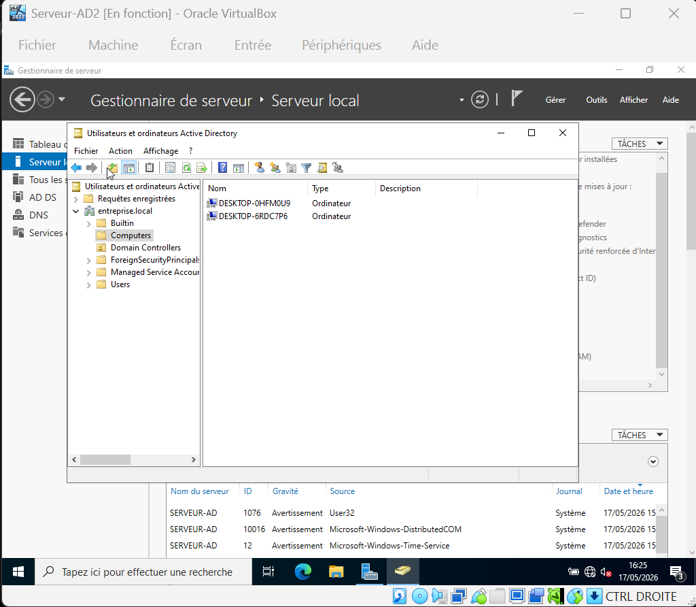

---

<h2 id="-étape-13--création-des-utilisateurs-active-directory" style="color:#1e64d6;">👥 Étape 13 — Création des utilisateurs Active Directory</h2>

<h3 style="color:#16803c;">13.1. Objectif de cette étape</h3>

L'objectif de cette étape est de créer des comptes utilisateurs dans Active Directory afin de :

- permettre l'ouverture de session sur les postes clients ;
- centraliser les utilisateurs ;
- préparer les futures stratégies de groupe (GPO) ;
- simuler une infrastructure d'entreprise réelle.

Jusqu'à présent, seuls des comptes locaux ou le compte Administrateur du domaine étaient utilisés.

Cette étape introduit maintenant :

```
la gestion centralisée des utilisateurs
```

<h3 style="color:#16803c;">13.2. Pourquoi créer des utilisateurs dans Active Directory ?</h3>

Dans une entreprise :

- chaque employé possède son propre compte ;
- les comptes sont stockés dans Active Directory ;
- les utilisateurs peuvent se connecter sur plusieurs postes ;
- les permissions sont centralisées.

Cela permet :

- une gestion simplifiée ;
- une meilleure sécurité ;
- une administration centralisée ;
- une meilleure traçabilité des accès.

<h3 style="color:#16803c;">13.3. Ouverture de la console Active Directory</h3>

Sur le serveur :

ouvrir :

```
Gestionnaire de serveur
→ Outils
→ Utilisateurs et ordinateurs Active Directory
```

La console Active Directory s'ouvre alors.

<h3 style="color:#16803c;">13.4. Structure Active Directory</h3>

Dans l'arborescence du domaine :

```
entreprise.local
```

plusieurs dossiers apparaissent :

- Computers ;
- Users ;
- Builtin ;
- Domain Controllers.

À quoi servent ces dossiers ?

**Computers**

Contient :

- les ordinateurs joints au domaine.

**Users**

Contient :

- les comptes utilisateurs ;
- certains groupes ;
- les comptes administratifs par défaut.

**Domain Controllers**

Contient :

- les contrôleurs de domaine Active Directory.

<h3 style="color:#16803c;">13.5. Création d'un nouvel utilisateur</h3>

Dans :

```
Users
```

faire :

clic droit :

```
Nouveau
→ Utilisateur
```

<h3 style="color:#16803c;">13.6. Informations utilisateur</h3>

Remplir les informations demandées.

Exemple :

```
Prénom : Younes
Nom : Andaloussi
Nom d'ouverture de session : younes
```

Cliquer ensuite sur :

```
Suivant
```

Explication du nom d'ouverture de session

Le nom d'ouverture de session correspond au login utilisé pour se connecter au domaine.

Exemple :

```
younes
```

L'utilisateur pourra ensuite ouvrir une session avec :

```
entreprise\younes
```

ou :

```
younes@entreprise.local
```

<h3 style="color:#16803c;">13.7. Configuration du mot de passe</h3>

Choisir un mot de passe sécurisé.

Exemple :

```
MotDePasse123!
```

Options importantes

Dans ce laboratoire, laisser :

```
L'utilisateur doit changer le mot de passe à la prochaine ouverture de session : désactivé
```

et laisser activé :

```
Le mot de passe n'expire jamais
```

Pourquoi désactiver l'expiration dans ce TP ?

Dans un environnement réel, les mots de passe expirent régulièrement pour des raisons de sécurité.

Mais dans un laboratoire pédagogique :

- cela évite des blocages ;
- cela simplifie les tests ;
- cela évite des problèmes de connexion pendant les démonstrations.

<h3 style="color:#16803c;">13.8. Finalisation de la création</h3>

Cliquer sur :

```
Suivant
→ Terminer
```

L'utilisateur apparaît maintenant dans Active Directory.

<h3 style="color:#16803c;">13.9. Création d'autres utilisateurs</h3>

Créer plusieurs utilisateurs supplémentaires afin de simuler une petite entreprise.

Exemple :

```
nordine
mariam
admin_test
```

Pourquoi créer plusieurs utilisateurs ?

Cela permettra plus tard de :

- tester les permissions ;
- tester les profils itinérants ;
- tester les GPO ;
- tester les groupes Active Directory ;
- simuler différents rôles utilisateurs.

<h3 style="color:#16803c;">13.10. Vérification des utilisateurs créés</h3>

Dans :

```
Users
```

les nouveaux comptes doivent apparaître.

<h3 style="color:#16803c;">13.11. Test de connexion avec un utilisateur du domaine</h3>

Sur un poste client :

se déconnecter puis ouvrir une session avec :

```
entreprise\younes
```

ou :

```
younes@entreprise.local
```

Entrer ensuite le mot de passe configuré.

Résultat attendu

Windows doit ouvrir une session domaine.

Lors de la première connexion :

- Windows crée automatiquement le profil utilisateur ;
- le compte devient utilisable sur le poste.

Pourquoi ce test est important ?

Ce test valide :

- l'authentification Active Directory ;
- la communication client ↔ serveur ;
- le bon fonctionnement du domaine ;
- la création des profils utilisateurs.

<h3 style="color:#16803c;">13.12. Résultat attendu</h3>

À la fin de cette étape :

- plusieurs utilisateurs Active Directory doivent exister ;
- les utilisateurs doivent apparaître dans la console AD ;
- une ouverture de session domaine doit fonctionner ;
- le serveur doit authentifier correctement les utilisateurs.

L'infrastructure Active Directory est maintenant pleinement opérationnelle avec :

- des postes membres ;
- des utilisateurs du domaine ;
- une authentification centralisée.

---

<h2 id="-étape-14--création-dune-unité-dorganisation-ou" style="color:#1e64d6;">🏢 Étape 14 — Création d'une Unité d'Organisation (OU)</h2>

<h3 style="color:#16803c;">14.1. Objectif de cette étape</h3>

L'objectif de cette étape est de créer une :

```
Unité d'Organisation (OU)
```

dans Active Directory afin de :

- organiser les utilisateurs ;
- organiser les ordinateurs ;
- préparer les futures stratégies de groupe (GPO) ;
- structurer l'infrastructure comme dans une vraie entreprise.

Jusqu'à présent :

- les utilisateurs étaient stockés dans le dossier Users ;
- les ordinateurs étaient stockés dans Computers.

Ces dossiers existent par défaut, mais ils ne sont pas adaptés à une administration professionnelle.

<h3 style="color:#16803c;">14.2. Qu'est-ce qu'une OU ?</h3>

Une OU (Organizational Unit) est un conteneur logique dans Active Directory.

Elle permet de :

- regrouper des utilisateurs ;
- regrouper des ordinateurs ;
- appliquer des stratégies spécifiques ;
- déléguer des permissions administratives.

Pourquoi les OU sont importantes ?

Dans une entreprise réelle :

on ne laisse jamais toute l'infrastructure dans :

```
Users
Computers
```

Les OU permettent de structurer proprement le domaine.

Exemple :

```
Entreprise
│
├── Utilisateurs
├── Informatique
├── Direction
├── Comptabilité
├── PC-Fixes
├── Portables
└── Serveurs
```

Cette organisation facilite énormément :

- l'administration ;
- la sécurité ;
- les stratégies de groupe ;
- le dépannage.

<h3 style="color:#16803c;">14.3. Ouverture de la console Active Directory</h3>

Sur le serveur :

ouvrir :

```
Gestionnaire de serveur
→ Outils
→ Utilisateurs et ordinateurs Active Directory
```

<h3 style="color:#16803c;">14.4. Création d'une OU principale</h3>

Dans l'arborescence :

faire un clic droit sur :

```
entreprise.local
```

Puis :

```
Nouveau
→ Unité d'organisation
```

<h3 style="color:#16803c;">14.5. Nom de l'OU</h3>

Créer une OU principale.

Exemple :

```
ENTREPRISE
```

Puis cliquer sur :

```
OK
```

Pourquoi créer une OU principale ?

Cette OU servira de conteneur principal pour toute l'infrastructure.

Cela permet :

- une meilleure organisation ;
- une séparation claire des objets Active Directory ;
- une administration plus professionnelle.

<h3 style="color:#16803c;">14.6. Création des sous-OU</h3>

Faire maintenant un clic droit sur :

```
ENTREPRISE
```

Puis :

```
Nouveau
→ Unité d'organisation
```

Créer ensuite plusieurs sous-OU.

Exemple :

```
UTILISATEURS
ORDINATEURS
SERVEURS
GROUPES
```

Pourquoi créer plusieurs OU ?

Chaque type d'objet peut être administré séparément.

Cela permettra plus tard :

- d'appliquer des GPO différentes ;
- de séparer les permissions ;
- de mieux organiser le domaine.

Exemple concret

On pourra par exemple :

- bloquer le panneau de configuration uniquement pour les utilisateurs ;
- appliquer des restrictions uniquement aux PC ;
- appliquer des règles spécifiques aux serveurs.

<h3 style="color:#16803c;">14.7. Déplacement des ordinateurs du domaine</h3>

Actuellement :

les PC joints au domaine apparaissent dans :

```
Computers
```

Mais dans une infrastructure propre :

les ordinateurs doivent être rangés dans l'OU :

```
ORDINATEURS
```

**Déplacement des postes**

Dans :

```
Computers
```

sélectionner :

- PC-1 ;
- PC-2.

Puis :

clic droit :

```
Déplacer
```

Choisir ensuite :

```
ENTREPRISE
→ ORDINATEURS
```

Puis :

```
OK
```

Pourquoi déplacer les ordinateurs ?

Le dossier :

```
Computers
```

est un conteneur système par défaut.

Il possède plusieurs limitations :

- gestion moins flexible ;
- GPO limitées ;
- structure moins professionnelle.

Les OU sont conçues spécialement pour l'administration Active Directory.

<h3 style="color:#16803c;">14.8. Déplacement des utilisateurs</h3>

Dans :

```
Users
```

sélectionner les utilisateurs créés précédemment.

Exemple :

```
younes
mariam
nordine
```

Puis :

```
clic droit
→ Déplacer
```

Choisir :

```
ENTREPRISE
→ UTILISATEURS
```

<h3 style="color:#16803c;">14.9. Vérification de la structure</h3>

L'arborescence Active Directory doit maintenant ressembler à ceci :

```
entreprise.local
│
├── ENTREPRISE
│   ├── UTILISATEURS
│   ├── ORDINATEURS
│   ├── SERVEURS
│   └── GROUPES
```

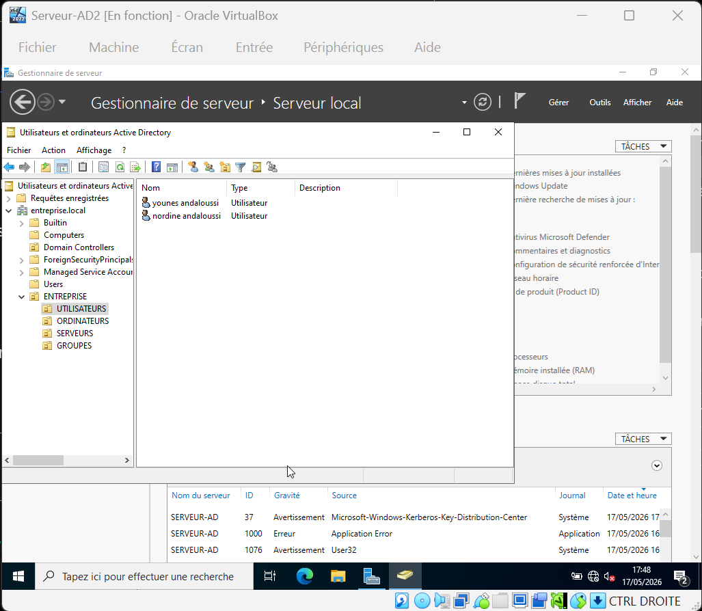

<h3 style="color:#16803c;">14.10. Pourquoi cette étape est importante ?</h3>

Cette étape est fondamentale dans une infrastructure Active Directory professionnelle.

Elle prépare :

- les GPO ;
- la sécurité ;
- la gestion des permissions ;
- les profils utilisateurs ;
- l'administration à grande échelle.

Une bonne structure Active Directory simplifie énormément :

- le dépannage ;
- la maintenance ;
- l'évolution future du réseau.

<h3 style="color:#16803c;">14.11. Résultat attendu</h3>

À la fin de cette étape :

- une OU principale doit exister ;
- plusieurs sous-OU doivent être créées ;
- les utilisateurs doivent être déplacés ;
- les ordinateurs doivent être déplacés ;
- l'infrastructure doit être organisée proprement.

Le domaine Active Directory possède maintenant :

- une structure logique ;
- une organisation professionnelle ;
- une base prête pour les futures stratégies de groupe (GPO).

---

<h2 id="-étape-15--création-et-gestion-des-groupes-active-directory" style="color:#1e64d6;">🧑‍🤝‍🧑 Étape 15 — Création et gestion des groupes Active Directory</h2>

<h3 style="color:#16803c;">15.1. Objectif de cette étape</h3>

L'objectif de cette étape est de créer des :

```
groupes Active Directory
```

afin de :

- simplifier la gestion des permissions ;
- centraliser les accès ;
- appliquer des droits plus facilement ;
- reproduire une infrastructure professionnelle réelle.

Dans une entreprise :

on attribue rarement les permissions directement aux utilisateurs.

On attribue plutôt les permissions à des groupes, puis on ajoute les utilisateurs dans ces groupes.

<h3 style="color:#16803c;">15.2. Pourquoi utiliser des groupes ?</h3>

Les groupes permettent :

- d'éviter de gérer chaque utilisateur individuellement ;
- de simplifier l'administration ;
- de rendre l'infrastructure évolutive ;
- de gagner énormément de temps.

Exemple concret

**Mauvaise méthode**

Donner les permissions :

- à Younes
- à Mariam
- à Nordine

**Bonne méthode**

Créer un groupe :

```
COMPTABILITE
```

Puis ajouter :

- Younes
- Mariam
- Nordine

Ensuite :

les permissions sont données au groupe uniquement.

**Avantage principal**

Si un nouvel employé arrive :

il suffit simplement de l'ajouter dans le groupe.

Aucune permission supplémentaire n'a besoin d'être reconfigurée.

<h3 style="color:#16803c;">15.3. Ouverture de la console Active Directory</h3>

Sur le serveur :

ouvrir :

```
Gestionnaire de serveur
→ Outils
→ Utilisateurs et ordinateurs Active Directory
```

<h3 style="color:#16803c;">15.4. Accéder à l'OU GROUPES</h3>

Dans l'arborescence :

ouvrir :

```
entreprise.local
→ ENTREPRISE
→ GROUPES
```

C'est dans cette OU que les groupes seront créés.

Pourquoi créer une OU GROUPES ?

Cela permet :

- une meilleure organisation ;
- une séparation claire entre utilisateurs et groupes ;
- une administration plus propre ;
- une structure professionnelle.

<h3 style="color:#16803c;">15.5. Création d'un premier groupe</h3>

Faire un clic droit dans l'OU :

```
GROUPES
```

Puis :

```
Nouveau
→ Groupe
```

<h3 style="color:#16803c;">15.6. Configuration du groupe</h3>

Exemple :

Nom du groupe :

```
Informatique
```

Type de groupe :

```
Sécurité
```

Étendue du groupe :

```
Globale
```

Puis cliquer sur :

```
OK
```

<h3 style="color:#16803c;">15.7. Explication des paramètres</h3>

**Groupe de sécurité**

Les groupes de sécurité servent à :

- attribuer des permissions ;
- gérer des accès ;
- appliquer des stratégies de sécurité.

C'est le type utilisé dans presque toutes les infrastructures professionnelles.

**Groupe global**

Les groupes globaux servent principalement à :

- regrouper les utilisateurs d'un même domaine.

C'est le choix le plus courant pour l'administration interne.

<h3 style="color:#16803c;">15.8. Création d'autres groupes</h3>

Créer maintenant plusieurs groupes supplémentaires.

Exemple :

```
Direction
Comptabilite
RH
Support
```

Pourquoi créer plusieurs groupes ?

Chaque département ou fonction possède généralement :

- ses propres permissions ;
- ses propres accès ;
- ses propres ressources.

Cela permet :

- une meilleure sécurité ;
- une séparation des accès ;
- une gestion claire des utilisateurs.

<h3 style="color:#16803c;">15.9. Ajout d'utilisateurs dans un groupe</h3>

Double-cliquer sur un groupe.

Exemple :

```
Informatique
```

Puis ouvrir l'onglet :

```
Membres
```

Cliquer sur :

```
Ajouter
```

Entrer ensuite un utilisateur.

Exemple :

```
younes
```

Puis :

```
Vérifier les noms
```

Ensuite :

```
OK
```

Faire la même chose pour les autres utilisateurs.

<h3 style="color:#16803c;">15.10. Pourquoi ajouter les utilisateurs dans des groupes ?</h3>

Cela permet :

- une administration centralisée ;
- une gestion plus simple ;
- une meilleure sécurité ;
- une structure professionnelle.

Dans une vraie entreprise :

les permissions sont pratiquement toujours attribuées aux groupes et non directement aux utilisateurs.

<h3 style="color:#16803c;">15.11. Vérification des groupes</h3>

Dans :

```
GROUPES
```

les groupes doivent maintenant apparaître correctement.

Les utilisateurs doivent également être visibles dans l'onglet :

```
Membres
```

de chaque groupe.

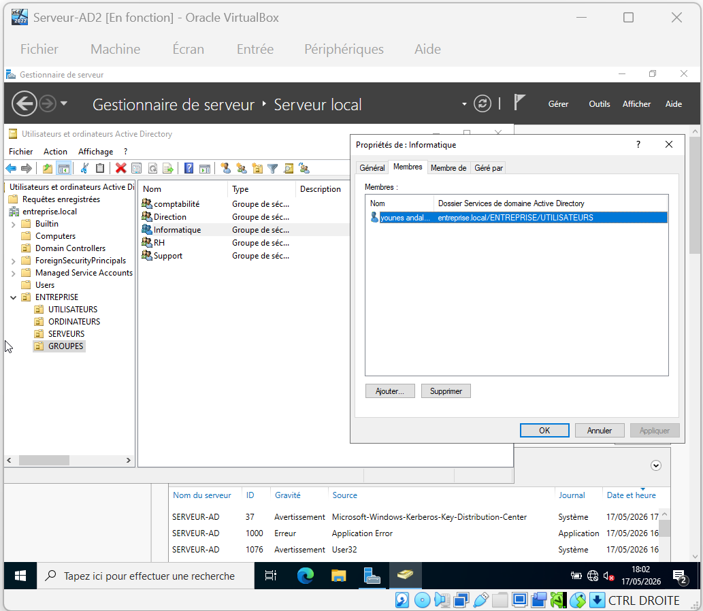

<h3 style="color:#16803c;">15.12. Résultat attendu</h3>

À la fin de cette étape :

- plusieurs groupes doivent exister ;
- les groupes doivent être rangés dans l'OU GROUPES ;
- des utilisateurs doivent être ajoutés dans les groupes ;
- l'infrastructure doit être mieux organisée.

Le domaine possède maintenant :

- une gestion centralisée des permissions ;
- une structure professionnelle ;
- une base prête pour la gestion des accès réseau.

---

<h2 id="-étape-16--création-dun-dossier-partagé-sur-le-serveur" style="color:#1e64d6;">📁 Étape 16 — Création d'un dossier partagé sur le serveur</h2>

<h3 style="color:#16803c;">16.1. Objectif de cette étape</h3>

L'objectif de cette étape est de créer un :

```
dossier partagé réseau
```

accessible depuis les ordinateurs du domaine.

Cette étape permet de :

- centraliser les fichiers ;
- partager des ressources sur le réseau ;
- gérer les permissions utilisateurs ;
- reproduire un environnement professionnel réel.

<h3 style="color:#16803c;">16.2. Pourquoi utiliser un partage réseau ?</h3>

Dans une entreprise :

les fichiers importants sont généralement stockés sur un serveur central.

Cela permet :

- des sauvegardes plus simples ;
- une gestion centralisée ;
- un meilleur contrôle des accès ;
- une sécurité renforcée.

Exemple concret

Au lieu de stocker des fichiers :

- sur PC-1 ;
- sur PC-2 ;
- sur plusieurs machines différentes ;

on les stocke directement sur :

```
SERVEUR-AD
```

Les utilisateurs accèdent ensuite aux fichiers via le réseau.

<h3 style="color:#16803c;">16.3. Création du dossier</h3>

Sur le serveur :

ouvrir :

```
Explorateur de fichiers
```

Puis créer un dossier.

Exemple :

```
C:\Partage
```

Pourquoi créer un dossier dédié ?

Cela permet :

- une meilleure organisation ;
- une gestion plus simple des permissions ;
- une séparation claire des données réseau.

<h3 style="color:#16803c;">16.4. Ouverture des propriétés du dossier</h3>

Faire un clic droit sur le dossier :

```
Partage
```

Puis :

```
Propriétés
```

Ouvrir ensuite l'onglet :

```
Partage
```

<h3 style="color:#16803c;">16.5. Configuration du partage réseau</h3>

Cliquer sur :

```
Partage avancé
```

Puis :

cocher :

```
Partager ce dossier
```

Nom du partage :

```
Partage
```

Puis cliquer sur :

```
Autorisations
```

<h3 style="color:#16803c;">16.6. Configuration des permissions réseau</h3>

Dans les autorisations :

supprimer si nécessaire :

```
Everyone
```

Puis ajouter :

- les groupes créés précédemment ;
- ou des utilisateurs spécifiques.

Exemple :

```
Informatique
```

Attribuer ensuite les permissions souhaitées :

- Lecture ;
- Modification ;
- Contrôle total.

Pourquoi éviter "Everyone" ?

Le groupe :

```
Everyone
```

donne potentiellement l'accès à tout le monde.

Dans une infrastructure professionnelle :

on limite toujours les accès au strict nécessaire.

Principe utilisé :

```
Principe du moindre privilège
```

<h3 style="color:#16803c;">16.7. Permissions de partage VS permissions NTFS</h3>

Sous Windows :

il existe deux niveaux de permissions :

**Permissions de partage**

Elles contrôlent :

- l'accès via le réseau.

**Permissions NTFS**

Elles contrôlent :

- les accès directement sur le disque ;
- les droits réels sur les fichiers.

Les deux systèmes fonctionnent ensemble.

Important

Même si un utilisateur possède :

```
Contrôle total
```

dans le partage réseau,

il peut quand même être bloqué par les permissions NTFS.

<h3 style="color:#16803c;">16.8. Configuration des permissions NTFS</h3>

Toujours dans les propriétés du dossier :

ouvrir l'onglet :

```
Sécurité
```

Cliquer sur :

```
Modifier
```

Puis :

```
Ajouter
```

Ajouter les groupes souhaités.

Exemple :

```
Informatique
```

Attribuer ensuite les permissions nécessaires.

Exemple :

- Modification
- Lecture et exécution
- Lecture

Pourquoi utiliser les groupes ?

Cela permet :

- d'ajouter facilement des utilisateurs ;
- d'éviter de modifier les permissions constamment ;
- de simplifier l'administration.

<h3 style="color:#16803c;">16.9. Vérification du partage réseau</h3>

Depuis le serveur :

ouvrir l'explorateur de fichiers puis entrer :

```
\\SERVEUR-AD
```

Le dossier partagé doit apparaître.

**Vérification depuis un poste client**

Depuis :

- PC-1 ;
- PC-2 ;

ouvrir :

```
Exécuter
```

Puis entrer :

```
\\SERVEUR-AD
```

Le dossier partagé doit être accessible.

<h3 style="color:#16803c;">16.10. Test de création de fichier</h3>

Depuis un poste client :

ouvrir le dossier partagé puis créer :

```
un fichier texte
```

Exemple :

```
test.txt
```

Cela permet de vérifier :

- les permissions ;
- l'écriture ;
- le bon fonctionnement du partage réseau.

<h3 style="color:#16803c;">16.11. Pourquoi cette étape est importante ?</h3>

Cette étape introduit plusieurs notions fondamentales :

- partage réseau ;
- permissions ;
- sécurité ;
- administration centralisée ;
- gestion des accès.

C'est une compétence essentielle dans les infrastructures Windows professionnelles.

<h3 style="color:#16803c;">16.12. Résultat attendu</h3>

À la fin de cette étape :

- un dossier partagé doit exister ;
- les permissions doivent fonctionner ;
- les utilisateurs autorisés doivent accéder au partage ;
- les postes clients doivent voir le serveur ;
- les fichiers doivent pouvoir être créés depuis le réseau.

L'infrastructure possède maintenant :

- un véritable partage réseau professionnel ;
- une gestion centralisée des données ;
- un système de permissions Active Directory fonctionnel.

---

<h2 id="-étape-17--mise-en-place-de-laccès-internet-via-le-serveur-nat--routage" style="color:#1e64d6;">🌍 Étape 17 — Mise en place de l'accès Internet via le serveur (NAT / Routage)</h2>

<h3 style="color:#16803c;">17.1. Objectif de cette étape</h3>

L'objectif de cette étape est de permettre aux postes clients du domaine :

- d'accéder à Internet ;
- sans connexion directe vers Internet ;
- en passant obligatoirement par le serveur Windows.

Le serveur jouera donc le rôle de :

- routeur ;
- passerelle réseau ;
- serveur NAT (Network Address Translation).

Cette architecture est proche d'une infrastructure d'entreprise réelle.

<h3 style="color:#16803c;">17.2. Pourquoi faire passer Internet par le serveur ?</h3>

Dans une infrastructure professionnelle :

les postes clients ne sont généralement pas connectés directement à Internet.

Le trafic réseau passe souvent par :

- un serveur ;
- un firewall ;
- un routeur centralisé.

Cela permet :

- un meilleur contrôle du réseau ;
- une meilleure sécurité ;
- une centralisation du trafic ;
- un filtrage possible ;
- une meilleure administration.

Dans notre infrastructure :

le serveur Windows Server 2022 jouera ce rôle grâce au service :

```
Routage et accès distant (RRAS)
```

<h3 style="color:#16803c;">17.3. Architecture réseau utilisée</h3>

Le serveur possède maintenant :

**Carte réseau 1 — Internet**

Cette carte utilise :

```
NAT VirtualBox
```

Elle permet au serveur lui-même d'accéder à Internet.

Nom de la carte :

```
internet
```

Adresse obtenue automatiquement :

```
10.0.2.x
```

Cette interface représente :

```
le réseau externe / Internet
```

**Carte réseau 2 — Réseau local**

Cette carte utilise :

```
Host-Only Adapter
```

Nom de la carte :

```
local
```

Adresse IP configurée manuellement :

```
192.168.1.10
```

Cette interface représente :

```
le réseau interne de l'entreprise
```

C'est cette interface qui communique avec :

- PC-1 ;
- PC-2 ;
- Active Directory ;
- DNS ;
- les partages réseau.

<h3 style="color:#16803c;">17.4. Installation du rôle Routage et accès distant</h3>

Depuis :

```
Gestionnaire de serveur
```

Cliquer sur :

```
Gérer
→ Ajouter des rôles et fonctionnalités
```

<h3 style="color:#16803c;">17.5. Type d'installation</h3>

Choisir :

```
Installation basée sur un rôle ou une fonctionnalité
```

Puis :

```
Suivant
```

<h3 style="color:#16803c;">17.6. Sélection du serveur</h3>

Sélectionner :

```
SERVEUR-AD
```

Puis :

```
Suivant
```

<h3 style="color:#16803c;">17.7. Sélection du rôle</h3>

Cocher :

```
Accès à distance
```

Puis :

```
Suivant
```

<h3 style="color:#16803c;">17.8. Services de rôle</h3>

Dans les services de rôle :

cocher :

```
Routage
```

Windows proposera automatiquement :

```
DirectAccess et VPN
```

ainsi que plusieurs outils d'administration.

Important :

Même si ces options sont cochées automatiquement,
nous utiliserons uniquement :

```
le service NAT / routage
```

Cliquer sur :

```
Ajouter des fonctionnalités
```

Puis :

```
Suivant
```

<h3 style="color:#16803c;">17.9. Installation du rôle</h3>

Cliquer sur :

```
Installer
```

Une fois l'installation terminée :

cliquer sur :

```
Fermer
```

<h3 style="color:#16803c;">17.10. Ouverture de RRAS</h3>

Ouvrir :

```
Outils
→ Routage et accès distant
```

<h3 style="color:#16803c;">17.11. Activation du serveur RRAS</h3>

Dans la console RRAS :

clic droit sur :

```
SERVEUR-AD
```

Puis :

```
Configurer et activer le routage et l'accès distant
```

<h3 style="color:#16803c;">17.12. Choix du mode de configuration</h3>

Choisir :

```
Configuration personnalisée
```

Pourquoi utiliser la configuration personnalisée ?

Le mode automatique fonctionne souvent mal avec :

- les machines virtuelles ;
- plusieurs cartes réseau ;
- les environnements VirtualBox.

La configuration manuelle permet :

- un meilleur contrôle ;
- une meilleure compréhension ;
- une configuration plus stable.

Cliquer sur :

```
Suivant
```

<h3 style="color:#16803c;">17.13. Activation du NAT</h3>

Cocher :

```
NAT
```

Puis :

```
Suivant
→ Terminer
```

Le service RRAS démarre alors.

<h3 style="color:#16803c;">17.14. Configuration des interfaces NAT</h3>

Dans RRAS :

développer :

```
IPv4
```

Puis :

```
NAT
```

<h3 style="color:#16803c;">17.15. Ajout de l'interface Internet</h3>

Clic droit sur :

```
NAT
→ Nouvelle interface
```

Sélectionner :

```
internet
```

Cette interface correspond à :

```
la carte NAT VirtualBox
```

Cliquer sur :

```
OK
```

<h3 style="color:#16803c;">17.16. Configuration de l'interface publique</h3>

Cocher :

```
Interface publique connectée à Internet
```

et :

```
Activer NAT sur cette interface
```

Puis :

```
OK
```

Pourquoi cette interface est-elle publique ?

Parce qu'elle représente :

```
l'accès Internet externe
```

C'est elle qui permettra :

- au serveur ;
- puis aux postes clients ;

de sortir vers Internet.

<h3 style="color:#16803c;">17.17. Ajout de l'interface locale</h3>

Refaire :

```
NAT
→ Nouvelle interface
```

Puis sélectionner :

```
local
```

Cette interface correspond au :

```
réseau interne de l'entreprise
```

Cliquer sur :

```
OK
```

<h3 style="color:#16803c;">17.18. Configuration de l'interface privée</h3>

Cocher :

```
Interface privée connectée au réseau privé
```

Puis :

```
OK
```

Pourquoi cette interface est-elle privée ?

Parce qu'elle sert uniquement à :

- communiquer avec les postes internes ;
- Active Directory ;
- le DNS ;
- les partages réseau.

Elle ne doit pas être exposée directement à Internet.

<h3 style="color:#16803c;">17.19. Configuration réseau des postes clients</h3>

Sur chaque poste client :

ouvrir :

```
Propriétés IPv4
```

**PC-1**

| Paramètre | Valeur |
|---|---|
| Adresse IP | 192.168.1.20 |
| Masque | 255.255.255.0 |
| Passerelle | 192.168.1.10 |
| DNS | 192.168.1.10 |

**PC-2**

| Paramètre | Valeur |
|---|---|
| Adresse IP | 192.168.1.21 |
| Masque | 255.255.255.0 |
| Passerelle | 192.168.1.10 |
| DNS | 192.168.1.10 |

<h3 style="color:#16803c;">17.20. Explication importante</h3>

**DNS**

```
192.168.1.10
```

Le serveur DNS est le contrôleur de domaine Active Directory.

Il permet :

- la résolution du domaine ;
- l'authentification ;
- la communication AD.

**Passerelle**

```
192.168.1.10
```

Le serveur devient maintenant :

- le routeur ;
- la sortie Internet des clients.

Le trafic suit maintenant ce chemin :

```
PC → SERVEUR-AD → NAT → Internet
```

<h3 style="color:#16803c;">17.21. Vérification du fonctionnement</h3>

Depuis un poste client :

ouvrir :

```
Invite de commandes
```

**Test réseau local**

```
ping 192.168.1.10
```

Le serveur doit répondre.

**Test Internet**

```
ping 8.8.8.8
```

Si le NAT fonctionne :

Internet est accessible.

**Test DNS**

```
ping google.com
```

Si ce test fonctionne :

- le routage ;
- le NAT ;
- le DNS ;

fonctionnent correctement.

<h3 style="color:#16803c;">17.22. Résultat attendu</h3>

À la fin de cette étape :

- les postes clients accèdent à Internet ;
- le trafic passe obligatoirement par le serveur ;
- le serveur agit comme routeur NAT ;
- l'infrastructure réseau est centralisée ;
- l'architecture est proche d'un environnement professionnel réel.

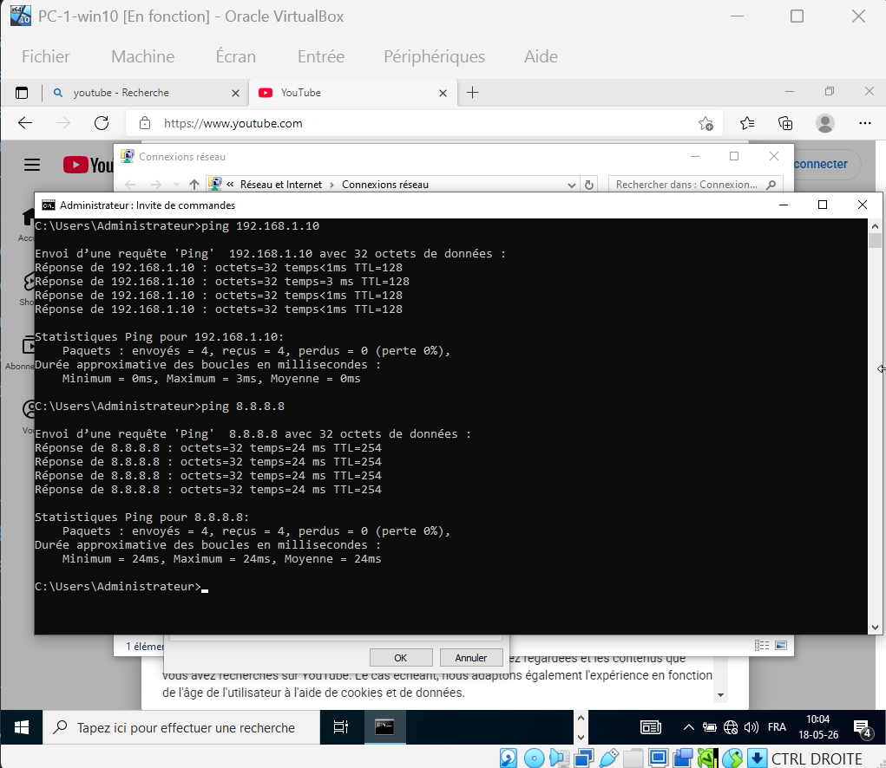

---

<h2 id="-étape-18--mise-en-place-des-profils-itinérants-roaming-profiles" style="color:#1e64d6;">🧳 Étape 18 — Mise en place des profils itinérants (Roaming Profiles)</h2>

<h3 style="color:#16803c;">18.1. Objectif de cette étape</h3>

L'objectif de cette étape est de permettre aux utilisateurs du domaine :

- de retrouver leur session sur n'importe quel poste ;
- de conserver automatiquement :
  - leur bureau ;
  - leurs documents ;
  - leurs paramètres ;
  - leur environnement Windows.

Grâce aux profils itinérants :

un utilisateur pourra :

- se connecter sur PC-1 ;
- puis retrouver exactement le même environnement sur PC-2.

<h3 style="color:#16803c;">18.2. Qu'est-ce qu'un profil itinérant ?</h3>

Un profil itinérant (Roaming Profile) est un profil utilisateur :

- stocké sur le serveur ;
- chargé automatiquement lors de la connexion ;
- synchronisé à la déconnexion.

Le profil contient notamment :

- le bureau ;
- les favoris ;
- les paramètres ;
- les fichiers utilisateur ;
- certaines configurations Windows.

<h3 style="color:#16803c;">18.3. Fonctionnement général</h3>

Sans profil itinérant :

```
le profil reste uniquement sur le PC local
```

Avec profil itinérant :

```
le profil est stocké sur le serveur
```

Le fonctionnement devient :

```
Utilisateur → connexion → téléchargement du profil depuis le serveur
```

Puis :

```
déconnexion → synchronisation vers le serveur
```

<h3 style="color:#16803c;">18.4. Création du dossier de profils</h3>

Sur le serveur :

créer un dossier :

```
C:\Profils
```

Pourquoi créer un dossier séparé ?

Cela permet :

- une meilleure organisation ;
- une séparation claire :
  - des partages ;
  - des profils utilisateurs ;
  - des données administratives.

<h3 style="color:#16803c;">18.5. Partage du dossier</h3>

Clic droit sur :

```
C:\Profils
```

Puis :

```
Propriétés
→ Partage
→ Partage avancé
```

<h3 style="color:#16803c;">18.6. Activation du partage</h3>

Cocher :

```
Partager ce dossier
```

Nom du partage :

```
Profils
```

Puis cliquer sur :

```
Autorisations
```

<h3 style="color:#16803c;">18.7. Permissions de partage</h3>

Supprimer :

```
Everyone
```

Ajouter :

```
Utilisateurs du domaine
```

Puis autoriser :

- Modification
- Lecture

Puis :

```
OK
```

<h3 style="color:#16803c;">18.8. Pourquoi ces permissions ?</h3>

Les utilisateurs doivent pouvoir :

- créer leur profil ;
- modifier leurs fichiers ;
- enregistrer leurs paramètres.

Sans autorisation d'écriture :

le profil itinérant ne fonctionnerait pas.

<h3 style="color:#16803c;">18.9. Configuration des permissions NTFS</h3>

Toujours dans :

```
Propriétés
→ Sécurité
```

Cliquer sur :

```
Modifier
```

Puis :

```
Ajouter
```

Ajouter :

```
Utilisateurs du domaine
```

Cliquer ensuite sur :

```
Vérifier les noms
```

Puis :

```
OK
```

<h3 style="color:#16803c;">18.10. Permissions NTFS à appliquer</h3>

Sélectionner :

```
Utilisateurs du domaine
```

Puis autoriser :

- Modification
- Lecture et exécution
- Afficher le contenu du dossier
- Lecture
- Écriture

Puis :

```
Appliquer
→ OK
```

<h3 style="color:#16803c;">18.11. Pourquoi les permissions NTFS sont-elles importantes ?</h3>

Les permissions NTFS contrôlent :

```
les véritables droits Windows sur le disque
```

Même si le partage réseau autorise l'accès :

le système NTFS peut encore :

- bloquer l'écriture ;
- empêcher la modification ;
- empêcher la synchronisation du profil.

Les permissions de partage et NTFS fonctionnent ensemble.

<h3 style="color:#16803c;">18.12. Différence entre partage et NTFS</h3>

**Permissions de partage**

Elles contrôlent :

```
l'accès réseau au dossier
```

**Permissions NTFS**

Elles contrôlent :

```
ce que l'utilisateur peut réellement faire dans Windows
```

Les deux systèmes se combinent.

L'autorisation finale appliquée est généralement :

```
la plus restrictive
```

<h3 style="color:#16803c;">18.13. Configuration du profil itinérant dans Active Directory</h3>

Ouvrir :

```
Utilisateurs et ordinateurs Active Directory
```

<h3 style="color:#16803c;">18.14. Ouverture des propriétés utilisateur</h3>

Aller dans l'OU contenant les utilisateurs.

Clic droit sur l'utilisateur :

```
Propriétés
```

<h3 style="color:#16803c;">18.15. Onglet Profil</h3>

Ouvrir :

```
Profil
```

Dans :

```
Chemin du profil
```

entrer :

```
\\SERVEUR-AD\Profils\%username%
```

Pourquoi utiliser :

```
%username%
```

?

Parce que Windows remplacera automatiquement :

```
%username%
```

par le nom réel de l'utilisateur.

Exemple :

```
\\SERVEUR-AD\Profils\younes
```

<h3 style="color:#16803c;">18.16. Validation</h3>

Cliquer sur :

```
Appliquer
→ OK
```

<h3 style="color:#16803c;">18.17. Premier test du profil itinérant</h3>

Sur :

```
PC-1
```

se connecter avec un utilisateur du domaine.

Créer par exemple :

- un dossier sur le bureau ;
- un fichier texte ;
- modifier le fond d'écran.

<h3 style="color:#16803c;">18.18. Déconnexion importante</h3>

Pour que le profil se synchronise correctement :

il faut impérativement :

```
faire une déconnexion de session
```

et non :

```
éteindre brutalement le PC
```

Pourquoi ?

Parce que le profil itinérant :

```
se synchronise au moment de la fermeture de session
```

<h3 style="color:#16803c;">18.19. Vérification sur le serveur</h3>

Sur le serveur :

ouvrir :

```
C:\Profils
```

Un dossier utilisateur doit avoir été créé automatiquement.

Exemple :

```
younes.V6
```

Pourquoi .V6 ?

Windows 10 utilise :

```
la version 6 des profils utilisateurs
```

Ce comportement est totalement normal.

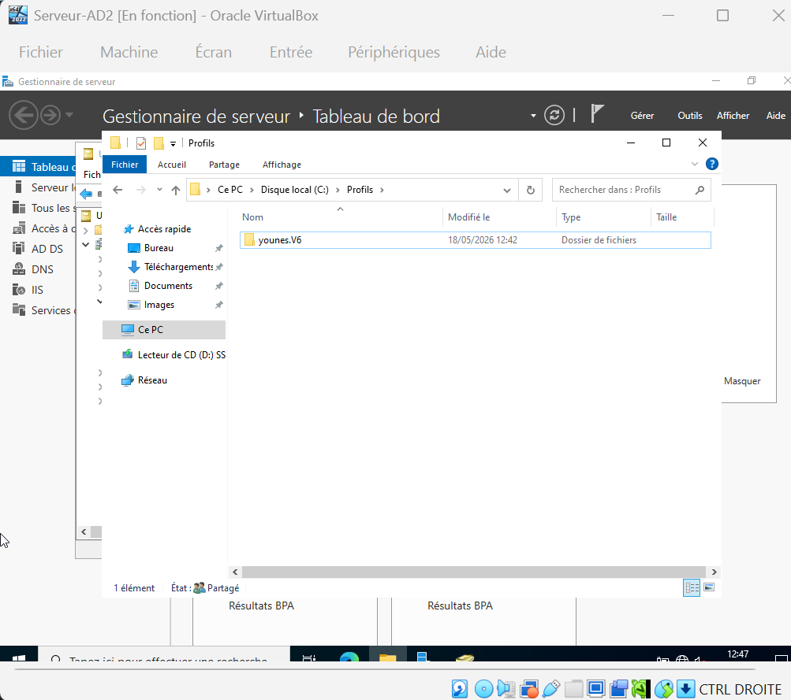

<h3 style="color:#16803c;">18.20. Protection automatique des profils</h3>

Lorsqu'un administrateur tente d'ouvrir directement le dossier profil :

Windows peut afficher :

```
Vous ne disposez pas des autorisations requises
```

C'est normal.

Windows protège automatiquement :

- les données utilisateur ;
- les profils personnels ;
- les permissions NTFS des profils itinérants.

<h3 style="color:#16803c;">18.21. Test sur un second poste</h3>

Se connecter maintenant sur :

```
PC-2
```

avec le même utilisateur.

Le bureau doit être identique :

- mêmes fichiers ;
- mêmes paramètres ;
- même environnement.

<h3 style="color:#16803c;">18.22. Résultat attendu</h3>

À la fin de cette étape :

- les profils utilisateurs sont centralisés ;
- les utilisateurs retrouvent leur session sur tous les postes ;
- les données sont stockées sur le serveur ;
- l'infrastructure se rapproche d'un environnement d'entreprise réel ;
- les utilisateurs deviennent indépendants du poste physique utilisé.

---

<h2 id="-étape-19--déploiement-automatique-de-vlc-via-une-stratégie-de-groupe-gpo" style="color:#1e64d6;">📦 Étape 19 — Déploiement automatique de VLC via une stratégie de groupe (GPO)</h2>

<h3 style="color:#16803c;">19.1. Objectif de cette étape</h3>

L'objectif de cette étape est de déployer automatiquement :

```
VLC Media Player
```

sur tous les postes du domaine grâce aux :

```
Stratégies de groupe (GPO)
```

Cette méthode permet :

- d'installer automatiquement un logiciel ;
- sans intervention manuelle sur chaque poste ;
- depuis le serveur Active Directory.

C'est une méthode très utilisée dans les entreprises.

<h3 style="color:#16803c;">19.2. Qu'est-ce qu'une GPO ?</h3>

Une GPO (Group Policy Object) est une stratégie Windows permettant :

- d'appliquer automatiquement des configurations ;
- sur des utilisateurs ;
- ou des ordinateurs du domaine.

Les GPO permettent notamment :

- d'installer des logiciels ;
- de configurer Windows ;
- de sécuriser les postes ;
- de déployer des règles réseau ;
- d'automatiser l'administration.

<h3 style="color:#16803c;">19.3. Pourquoi utiliser un déploiement logiciel par GPO ?</h3>

Sans GPO :

il faudrait :

- installer VLC manuellement ;
- sur chaque ordinateur.

Avec une GPO :

```
le serveur installe automatiquement le logiciel
```

Cela apporte :

- gain de temps ;
- centralisation ;
- administration simplifiée ;
- standardisation des postes.

<h3 style="color:#16803c;">19.4. Téléchargement du package MSI de VLC</h3>

Important :

Le déploiement GPO nécessite :

```
un fichier MSI
```

et non :

```
un fichier EXE
```

<h3 style="color:#16803c;">19.5. Téléchargement de VLC</h3>

Télécharger la version MSI de VLC depuis le site officiel :

```
VideoLAN (VLC)
```

<h3 style="color:#16803c;">19.6. Création du dossier de déploiement</h3>

Sur le serveur :

créer un dossier :

```
C:\Deploy
```

Puis :

```
C:\Deploy\VLC
```

Copier le fichier :

```
vlc-3.0.23-win64.msi
```

dans ce dossier.

<h3 style="color:#16803c;">19.7. Partage du dossier de déploiement</h3>

Clic droit sur :

```
C:\Deploy
```

Puis :

```
Propriétés
→ Partage
→ Partage avancé
```

Cocher :

```
Partager ce dossier
```

Nom du partage :

```
Deploy
```

<h3 style="color:#16803c;">19.8. Permissions de partage</h3>

Cliquer sur :

```
Autorisations
```

Supprimer :

```
Everyone
```

Ajouter :

```
Ordinateurs du domaine
```

Puis autoriser :

- Lecture

Ajouter également :

```
Administrateurs
```

Puis autoriser :

- Contrôle total

Pourquoi utiliser :

```
Ordinateurs du domaine
```

?

Parce que le logiciel sera installé :

```
par les ordinateurs eux-mêmes
```

au démarrage de Windows.

Pourquoi ajouter :

```
Administrateurs
```

?

Parce que les administrateurs doivent pouvoir :

- accéder au dossier ;
- modifier les fichiers ;
- gérer les packages MSI ;
- administrer le partage réseau.

<h3 style="color:#16803c;">19.9. Permissions NTFS</h3>

Dans :

```
Propriétés
→ Sécurité
```

Ajouter :

```
Ordinateurs du domaine
```

Puis autoriser :

- Lecture et exécution
- Lecture

Ajouter également :

```
Administrateurs
```

Puis autoriser :

- Contrôle total

Pourquoi les permissions NTFS sont-elles importantes ?

Parce que même si le partage réseau autorise l'accès :

```
Windows peut encore bloquer l'accès au niveau du disque
```

Les permissions réseau et NTFS doivent être cohérentes.

<h3 style="color:#16803c;">19.10. Ouverture de la gestion des stratégies de groupe</h3>

Ouvrir :

```
Outils
→ Gestion de stratégie de groupe
```

<h3 style="color:#16803c;">19.11. Création de la GPO</h3>

Dans :

```
Forêt
→ Domaines
→ entreprise.local
```

Clic droit sur :

```
entreprise.local
```

Puis :

```
Créer un objet GPO dans ce domaine et le lier ici
```

Nom :

```
Déploiement VLC
```

Puis :

```
OK
```

<h3 style="color:#16803c;">19.12. Modification de la GPO</h3>

Clic droit sur :

```
Déploiement VLC
```

Puis :

```
Modifier
```

<h3 style="color:#16803c;">19.13. Configuration du déploiement logiciel</h3>

Aller dans :

```
Configuration ordinateur
→ Stratégies
→ Paramètres du logiciel
→ Installation de logiciel
```

<h3 style="color:#16803c;">19.14. Ajout du package MSI</h3>

Clic droit :

```
Installation de logiciel
→ Nouveau
→ Package
```

<h3 style="color:#16803c;">19.15. Important — Utiliser un chemin réseau UNC</h3>

Ne jamais utiliser :

```
C:\Deploy\VLC\vlc.msi
```

Il faut obligatoirement utiliser :

```
un chemin réseau UNC
```

Exemple :

```
\\SERVEUR-AD\Deploy\VLC\vlc-3.0.23-win64.msi
```

Pourquoi ?

Parce que les postes clients doivent accéder :

```
au fichier via le réseau
```

et non via le disque local du serveur.

<h3 style="color:#16803c;">19.16. Méthode de déploiement</h3>

Choisir :

```
Attribué
```

Puis :

```
OK
```

Pourquoi choisir "Attribué" ?

Parce que le logiciel sera installé automatiquement :

- au démarrage du poste ;
- avant l'ouverture de session.

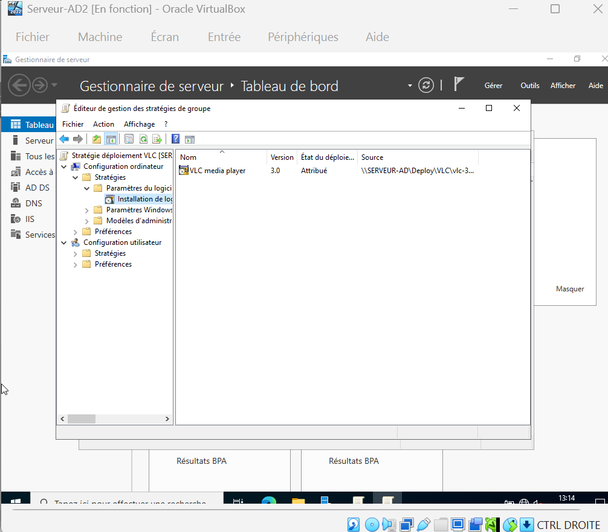

<h3 style="color:#16803c;">19.17. Mise à jour des stratégies</h3>

Sur les postes clients :

ouvrir :

```
Invite de commandes
```

Puis exécuter :

```
gpupdate /force
```

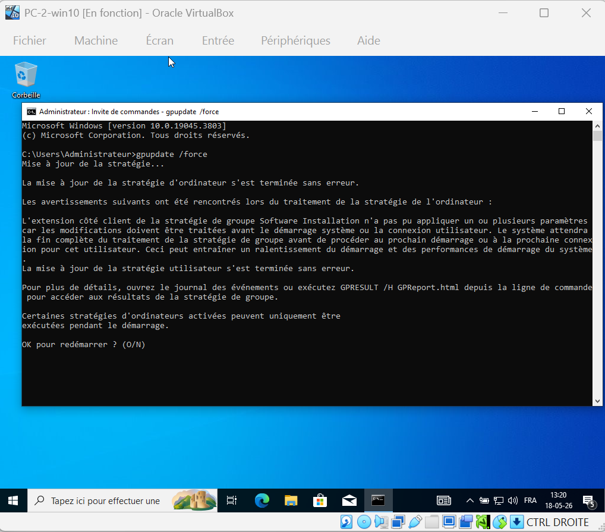

<h3 style="color:#16803c;">19.18. Redémarrage des postes</h3>

Redémarrer :

- PC-1 ;
- PC-2.

Pourquoi le redémarrage est-il nécessaire ?

Parce que :

```
les logiciels attribués aux ordinateurs s'installent au démarrage
```

<h3 style="color:#16803c;">19.19. Installation automatique de VLC</h3>

Au redémarrage :

Windows affichera :

```
Application des paramètres de l'ordinateur
```

Puis VLC sera installé automatiquement.

Aucune installation manuelle n'est nécessaire.

<h3 style="color:#16803c;">19.20. Vérification du déploiement</h3>

Après connexion :

ouvrir :

```
Menu Démarrer
```

VLC doit maintenant apparaître sur les postes clients.

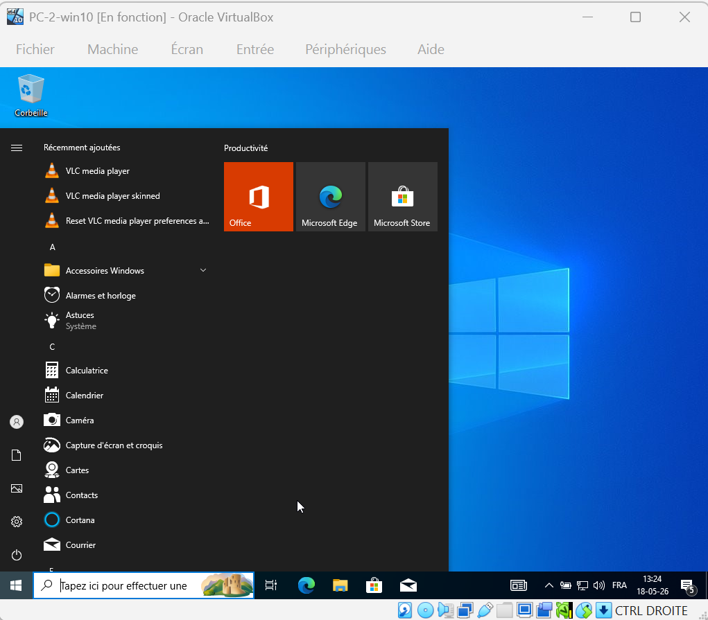

<h3 style="color:#16803c;">19.21. Résultat attendu</h3>

À la fin de cette étape :

- VLC est déployé automatiquement ;
- tous les postes du domaine reçoivent le logiciel ;
- aucune installation manuelle n'est nécessaire ;
- l'administration logicielle devient centralisée ;
- l'infrastructure se rapproche fortement d'un environnement professionnel réel.

---

<h2 id="-étape-20--mise-en-place-du-serveur-dhcp" style="color:#1e64d6;">📡 Étape 20 — Mise en place du serveur DHCP</h2>

<h3 style="color:#16803c;">20.1. Objectif de cette étape</h3>

L'objectif de cette étape est de mettre en place un serveur DHCP dans l'infrastructure Active Directory.

Le rôle DHCP permettra :

- d'attribuer automatiquement une adresse IP aux postes clients ;
- de distribuer automatiquement :
  - le masque réseau ;
  - la passerelle ;
  - le serveur DNS ;
- d'éviter les configurations IP manuelles sur chaque ordinateur ;
- de simplifier l'ajout de nouveaux postes dans le domaine.

Cette configuration rapproche fortement l'infrastructure d'un véritable environnement d'entreprise.

<h3 style="color:#16803c;">20.2. Qu'est-ce qu'un serveur DHCP ?</h3>

DHCP signifie :

```
Dynamic Host Configuration Protocol
```

Le DHCP est un service réseau permettant d'attribuer automatiquement des paramètres réseau aux ordinateurs du réseau.

Sans DHCP :

```
chaque machine doit être configurée manuellement
```

Avec DHCP :

le serveur distribue automatiquement :

- l'adresse IP ;
- le masque ;
- la passerelle ;
- le DNS.

<h3 style="color:#16803c;">20.3. Pourquoi utiliser DHCP dans une infrastructure Active Directory ?</h3>

Dans une entreprise :

il peut y avoir :

- des dizaines ;
- des centaines ;
- voire des milliers d'ordinateurs.

Configurer chaque poste manuellement serait :

- très long ;
- peu pratique ;
- source d'erreurs.

Le DHCP permet :

- une administration centralisée ;
- une meilleure cohérence réseau ;
- un gain de temps considérable.

<h3 style="color:#16803c;">20.4. Important — Le serveur reste en IP statique</h3>

Même avec DHCP :

le serveur Active Directory DOIT conserver :

```
une adresse IP statique
```

Dans cette infrastructure :

| Élément | Adresse |
|---|---|
| Serveur AD/DNS/DHCP | 192.168.1.10 |

Pourquoi ?

Parce que :

- les clients doivent toujours retrouver le serveur ;
- Active Directory dépend du DNS ;
- le DNS dépend du serveur ;
- le contrôleur de domaine doit avoir une adresse fixe.

Seuls les postes clients utiliseront DHCP.

<h3 style="color:#16803c;">20.5. Installation du rôle DHCP</h3>

Depuis le serveur :

ouvrir :

```
Gestionnaire de serveur
```

Puis :

```
Gérer
→ Ajouter des rôles et fonctionnalités
```

<h3 style="color:#16803c;">20.6. Type d'installation</h3>

Sélectionner :

```
Installation basée sur un rôle ou une fonctionnalité
```

Puis :

```
Suivant
```

<h3 style="color:#16803c;">20.7. Sélection du serveur</h3>

Sélectionner le serveur local :

```
SERVEUR-AD
```

Puis :

```
Suivant
```

<h3 style="color:#16803c;">20.8. Sélection du rôle DHCP</h3>

Cocher :

```
Serveur DHCP
```

Windows proposera automatiquement :

```
des outils supplémentaires
```

Cliquer sur :

```
Ajouter des fonctionnalités
```

Puis :

```
Suivant
```

<h3 style="color:#16803c;">20.9. Fonctionnalités supplémentaires</h3>

Laisser les paramètres par défaut.

Cliquer sur :

```
Suivant
```

<h3 style="color:#16803c;">20.10. Présentation du rôle DHCP</h3>

Windows affiche une description du service DHCP.

Cette page explique que le serveur pourra :

- distribuer automatiquement des adresses IP ;
- gérer des plages d'adresses ;
- centraliser les paramètres réseau.

Cliquer sur :

```
Suivant
```

<h3 style="color:#16803c;">20.11. Confirmation de l'installation</h3>

Cliquer sur :

```
Installer
```

Attendre la fin de l'installation.

<h3 style="color:#16803c;">20.12. Finalisation du DHCP</h3>

Une fois l'installation terminée :

une notification apparaîtra dans le Gestionnaire de serveur.

Cliquer sur :

```
Terminer la configuration DHCP
```

<h3 style="color:#16803c;">20.13. Autorisation du serveur DHCP dans Active Directory</h3>

L'assistant DHCP s'ouvre.

Cliquer sur :

```
Suivant
```

Le serveur DHCP doit être autorisé dans Active Directory.

Pourquoi cette autorisation est-elle importante ?

Dans un domaine Active Directory :

Microsoft empêche les serveurs DHCP non autorisés de distribuer des adresses IP.

Cela évite :

- les faux serveurs DHCP ;
- les conflits réseau ;
- les problèmes de sécurité.

<h3 style="color:#16803c;">20.14. Validation des informations d'identification</h3>

L'assistant utilisera normalement automatiquement :

```
Administrateur
```

du domaine Active Directory.

Cliquer sur :

```
Valider
```

Puis :

```
Suivant
```

Ensuite :

```
Fermer
```

<h3 style="color:#16803c;">20.15. Ouverture de la console DHCP</h3>

Dans le Gestionnaire de serveur :

```
Outils
→ DHCP
```

La console DHCP s'ouvre.

<h3 style="color:#16803c;">20.16. Création d'une nouvelle étendue DHCP</h3>

Développer :

```
IPv4
```

Faire :

```
clic droit sur IPv4
→ Nouvelle étendue
```

Pourquoi créer une étendue ?

Une étendue DHCP définit :

```
la plage d'adresses IP qui pourra être distribuée automatiquement aux clients
```

<h3 style="color:#16803c;">20.17. Nom de l'étendue</h3>

Nom :

```
LAN-ENTREPRISE
```

Description :

```
Réseau interne Active Directory
```

Puis :

```
Suivant
```

<h3 style="color:#16803c;">20.18. Définition de la plage IP</h3>

Configurer :

| Paramètre | Valeur |
|---|---|
| Début | 192.168.1.100 |
| Fin | 192.168.1.200 |
| Masque | 255.255.255.0 |

Pourquoi commencer à 100 ?

Les premières adresses sont réservées :

- au serveur ;
- aux équipements réseau ;
- aux périphériques fixes.

<h3 style="color:#16803c;">20.19. Exclusions DHCP</h3>

Ne rien ajouter.

Cliquer sur :

```
Suivant
```

<h3 style="color:#16803c;">20.20. Durée du bail DHCP</h3>

Laisser :

```
8 jours
```

Puis :

```
Suivant
```

Le bail représente :

```
la durée pendant laquelle un client conserve son adresse IP
```

<h3 style="color:#16803c;">20.21. Configuration des options DHCP</h3>

Sélectionner :

```
Oui, je veux configurer ces options maintenant
```

Puis :

```
Suivant
```

<h3 style="color:#16803c;">20.22. Configuration de la passerelle</h3>

Ajouter :

```
192.168.1.10
```

Puis :

```
Ajouter
```

Pourquoi ?

Le serveur sert également :

- de routeur NAT ;
- de passerelle Internet.

Les clients passeront donc par le serveur pour accéder à Internet.

<h3 style="color:#16803c;">20.23. Configuration du DNS</h3>

Configurer :

| Paramètre | Valeur |
|---|---|
| Domaine parent | entreprise.local |
| DNS | 192.168.1.10 |

Cliquer sur :

```
Ajouter
```

Puis :

```
Suivant
```

Pourquoi utiliser le DNS du serveur ?

Parce que :

- Active Directory dépend du DNS ;
- les clients doivent trouver le contrôleur de domaine ;
- les GPO ;
- les profils itinérants ;
- les partages réseau ;
- les services Active Directory.

Le serveur DNS du domaine est donc obligatoire.

<h3 style="color:#16803c;">20.24. WINS</h3>

Ne rien configurer.

Cliquer sur :

```
Suivant
```

<h3 style="color:#16803c;">20.25. Activation de l'étendue</h3>

Sélectionner :

```
Oui, activer cette étendue maintenant
```

Puis :

```
Suivant
```

Ensuite :

```
Terminer
```

<h3 style="color:#16803c;">20.26. Résultat attendu</h3>

À la fin de cette étape :

- le rôle DHCP doit être installé ;
- une étendue IPv4 doit être active ;
- le serveur doit distribuer automatiquement :
  - les adresses IP ;
  - le DNS ;
  - la passerelle ;
- les futurs postes clients pourront être configurés automatiquement.

<h3 style="color:#16803c;">20.27. Architecture réseau finale</h3>

L'architecture réseau fonctionne maintenant de cette manière :

```
PC Client
   ↓
DHCP → reçoit automatiquement :
- IP
- DNS
- Passerelle

   ↓
Serveur Active Directory
- AD DS
- DNS
- DHCP
- NAT/Routage
- GPO
- Profils itinérants

   ↓
Internet
```

<h3 style="color:#16803c;">20.28. Importance de cette étape</h3>

Cette étape transforme l'infrastructure en une architecture beaucoup plus professionnelle.

Le réseau devient :

- automatisé ;
- centralisé ;
- évolutif ;
- administrable comme dans une vraie entreprise.

Le serveur gère désormais :

- l'authentification ;
- le DNS ;
- l'accès Internet ;
- les profils utilisateurs ;
- les stratégies ;
- la distribution automatique des adresses IP.

---

<h2 id="-étape-21--vérification-du-fonctionnement-du-dhcp-sur-les-postes-clients" style="color:#1e64d6;">🔎 Étape 21 — Vérification du fonctionnement du DHCP sur les postes clients</h2>

<h3 style="color:#16803c;">21.1. Objectif de cette étape</h3>

L'objectif de cette étape est de vérifier que :

- le serveur DHCP fonctionne correctement ;
- les postes clients reçoivent automatiquement leurs paramètres réseau ;
- les clients utilisent correctement :
  - le DNS du serveur ;
  - la passerelle du serveur ;
- l'accès Internet via le serveur NAT est opérationnel.

Cette étape permet de valider l'automatisation complète du réseau.

<h3 style="color:#16803c;">21.2. Principe du fonctionnement DHCP</h3>

Grâce au DHCP :

les postes clients n'ont plus besoin d'être configurés manuellement.

Lorsqu'un ordinateur démarre :

il envoie automatiquement une requête DHCP sur le réseau.

Le serveur DHCP répond alors avec :

- une adresse IP ;
- un masque réseau ;
- une passerelle ;
- un serveur DNS.

Le poste client peut alors communiquer immédiatement sur le réseau sans configuration manuelle.

<h3 style="color:#16803c;">21.3. Passage des postes clients en configuration automatique</h3>

Sur les postes clients :

```
PC-1
```

et

```
PC-2
```

ouvrir :

```
Centre Réseau et partage
→ Modifier les paramètres de la carte
```

<h3 style="color:#16803c;">21.4. Configuration IPv4 automatique</h3>

Faire :

```
clic droit sur la carte réseau
→ Propriétés
```

Sélectionner :

```
Protocole Internet version 4 (TCP/IPv4)
```

Puis :

```
Propriétés
```

<h3 style="color:#16803c;">21.5. Activation du DHCP</h3>

Sélectionner :

```
Obtenir une adresse IP automatiquement
```

et :

```
Obtenir les adresses des serveurs DNS automatiquement
```

Puis :

```
OK
```

Pourquoi cette étape est-elle importante ?

Les postes clients ne possèdent plus :

- d'adresse IP statique ;
- de DNS configuré manuellement.

Toute la configuration réseau est maintenant distribuée automatiquement par le serveur DHCP.

<h3 style="color:#16803c;">21.6. Renouvellement de la configuration réseau</h3>

Ouvrir :

```
Invite de commandes
```

Puis exécuter :

```
ipconfig /release
```

Ensuite :

```
ipconfig /renew
```

Pourquoi utiliser ces commandes ?

Ces commandes permettent :

- de libérer l'ancienne configuration IP ;
- de demander immédiatement une nouvelle configuration au serveur DHCP.

<h3 style="color:#16803c;">21.7. Vérification de l'adresse IP attribuée</h3>

Toujours dans l'invite de commandes :

exécuter :

```
ipconfig
```

Le poste client doit maintenant recevoir automatiquement :

| Paramètre | Valeur attendue |
|---|---|
| Adresse IP | 192.168.1.x |
| Masque | 255.255.255.0 |
| Passerelle | 192.168.1.10 |
| DNS | 192.168.1.10 |

Exemple obtenu dans cette infrastructure :

| Paramètre | Valeur |
|---|---|
| IP | 192.168.1.100 |
| Passerelle | 192.168.1.10 |

<h3 style="color:#16803c;">21.8. Vérification de l'accès Internet</h3>

Toujours dans l'invite de commandes :

exécuter :

```
ping google.com
```

Résultat attendu :

des réponses doivent être reçues depuis Internet.

Pourquoi ce test est-il important ?

Ce test valide simultanément :

- le DHCP ;
- le DNS ;
- le routage ;
- le NAT ;
- l'accès Internet via le serveur.

Le poste client utilise désormais :

- le serveur Active Directory comme DNS ;
- le serveur Active Directory comme passerelle réseau.

L'ensemble du trafic passe donc par le serveur.

<h3 style="color:#16803c;">21.9. Vérification des baux DHCP sur le serveur</h3>

Depuis le serveur :

ouvrir :

```
DHCP
→ IPv4
→ LAN-ENTREPRISE
→ Baux d'adresses
```

Le serveur doit afficher :

- les postes clients ;
- leurs adresses IP attribuées automatiquement ;
- leur durée de bail DHCP.

Pourquoi cette vérification est-elle importante ?

Elle prouve que :

- les clients communiquent correctement avec le serveur DHCP ;
- les adresses sont bien distribuées automatiquement ;
- le réseau fonctionne de manière centralisée.

<h3 style="color:#16803c;">21.10. Résultat attendu</h3>

À la fin de cette étape :

- les postes clients reçoivent automatiquement leurs paramètres réseau ;
- les clients utilisent le serveur comme DNS ;
- les clients utilisent le serveur comme passerelle ;
- l'accès Internet via le serveur fonctionne ;
- le DHCP distribue automatiquement les adresses IP ;
- les baux DHCP apparaissent dans la console DHCP.

<h3 style="color:#16803c;">21.11. Architecture réseau finale</h3>

L'infrastructure fonctionne désormais de la manière suivante :

```
Postes clients
        ↓
DHCP automatique
(IP + DNS + passerelle)

        ↓
Serveur Windows Server 2022
- Active Directory
- DNS
- DHCP
- NAT / Routage
- GPO
- Profils itinérants
- Partages réseau

        ↓
Internet
```

<h3 style="color:#16803c;">21.12. Importance de cette étape</h3>

Cette étape finalise l'automatisation complète de l'infrastructure réseau.

Le réseau possède maintenant :

- une gestion centralisée ;
- une distribution automatique des adresses IP ;
- une authentification centralisée ;
- un accès Internet contrôlé ;
- une administration similaire à une véritable infrastructure d'entreprise.

Le serveur devient désormais :

- le cœur du domaine ;
- le serveur DNS ;
- le serveur DHCP ;
- la passerelle Internet ;
- le point central de gestion de toute l'infrastructure réseau.

---

<h2 id="-conclusion" style="color:#1e64d6;">🎓 Conclusion</h2>

Ce projet m'a permis de construire une infrastructure réseau Windows complète et cohérente, proche d'un environnement professionnel réel.
L'objectif n'était pas uniquement de faire fonctionner les différents services, mais surtout de comprendre précisément le rôle de chaque composant, leurs interactions, ainsi que la logique globale d'une architecture client/serveur moderne.

Au travers de ce travail, j'ai mis en place :

- un serveur Windows Server 2022 ;
- un domaine Active Directory ;
- un serveur DNS ;
- un serveur DHCP ;
- l'intégration de plusieurs postes clients au domaine ;
- une gestion centralisée des utilisateurs et des groupes ;
- des partages réseau sécurisés ;
- des permissions de partage et NTFS ;
- des profils itinérants ;
- un accès Internet pour les clients via le serveur grâce au routage NAT ;
- ainsi qu'un déploiement automatisé de logiciels via les stratégies de groupe (GPO).

L'un des points les plus intéressants de ce projet a été la mise en place des profils itinérants.
Cette fonctionnalité m'a permis de comprendre concrètement comment un utilisateur peut retrouver automatiquement son environnement personnel sur n'importe quel poste du domaine, avec ses fichiers, ses paramètres et son bureau synchronisés depuis le serveur.

La configuration du routage NAT a également été une étape importante.
Le fait de faire passer l'accès Internet des postes clients par le serveur permet de reproduire une logique d'infrastructure d'entreprise plus sécurisée et plus centralisée, où le serveur devient un point de contrôle du réseau interne.

Ce projet m'a aussi permis de mieux comprendre la différence essentielle entre :

- les permissions de partage ;
- les permissions NTFS.

Avant ce travail, ces notions me semblaient abstraites.
Les différents tests réalisés m'ont permis de voir concrètement comment Windows applique réellement les droits d'accès et comment ces mécanismes influencent la sécurité d'une infrastructure.

Au-delà de la partie technique, ce travail reflète également ma manière d'apprendre :
je cherche toujours à comprendre le fonctionnement réel des systèmes plutôt qu'à simplement appliquer des étapes sans logique.
Chaque problème rencontré durant ce projet a été une occasion de mieux comprendre Windows Server, Active Directory et l'administration réseau.

Cette documentation a été pensée comme :

- un support personnel de compréhension ;
- un guide réutilisable ;
- un tutoriel détaillé pour d'autres étudiants ;
- mais aussi comme une démonstration de mes compétences et de ma progression dans le domaine de l'informatique de gestion et de l'administration système.

Ce projet représente pour moi une étape importante de ma première année de bachelier en informatique.
Il montre non seulement les compétences techniques acquises, mais également ma motivation à approfondir les infrastructures réseau professionnelles et les environnements Windows d'entreprise.

<div align="center">
<p><strong>Travail réalisé par</strong></p>
<p><strong>Younes Andaloussi</strong><br>
Bachelier en Informatique de Gestion<br>
Projet de réseau — Examen de fin de première année</p>
</div>
